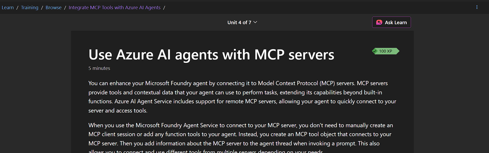
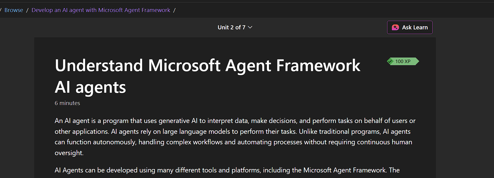
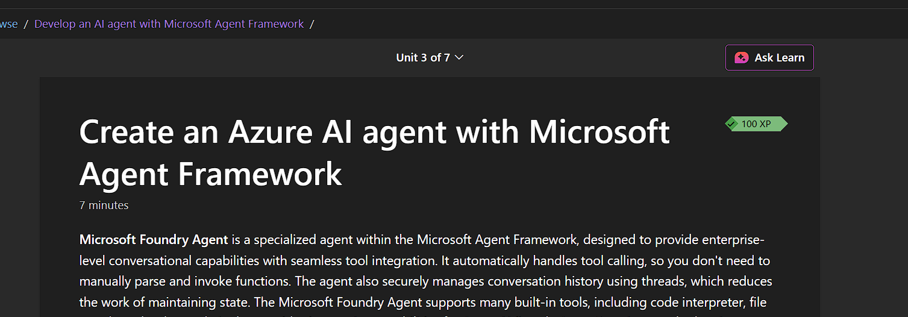
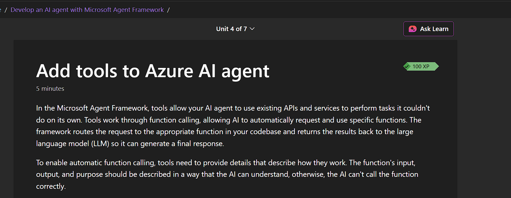
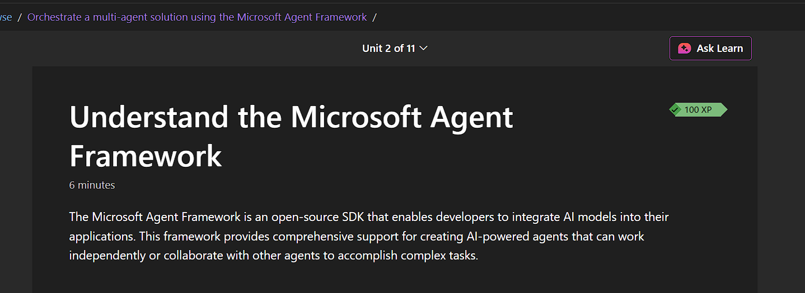
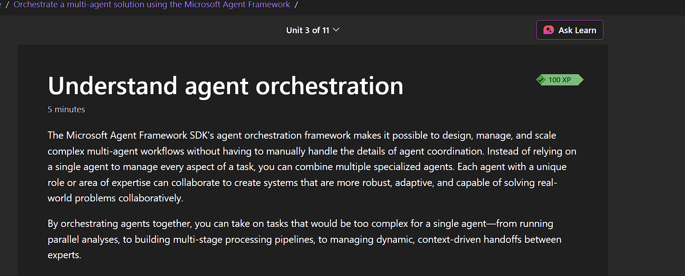
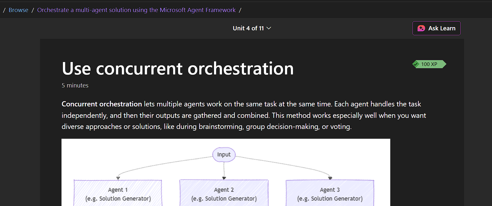
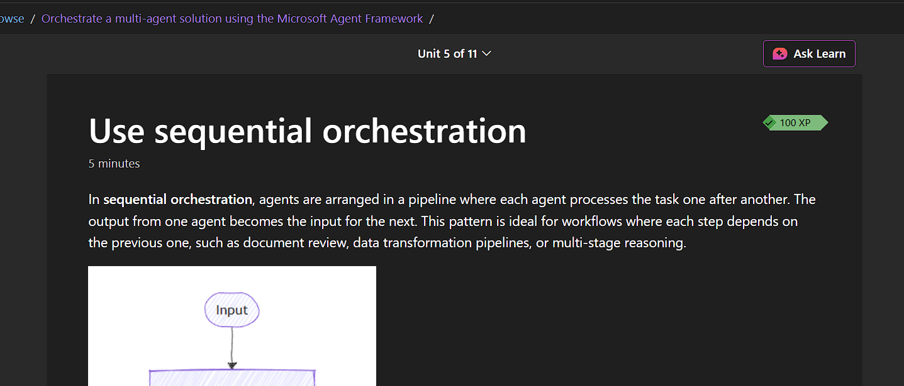
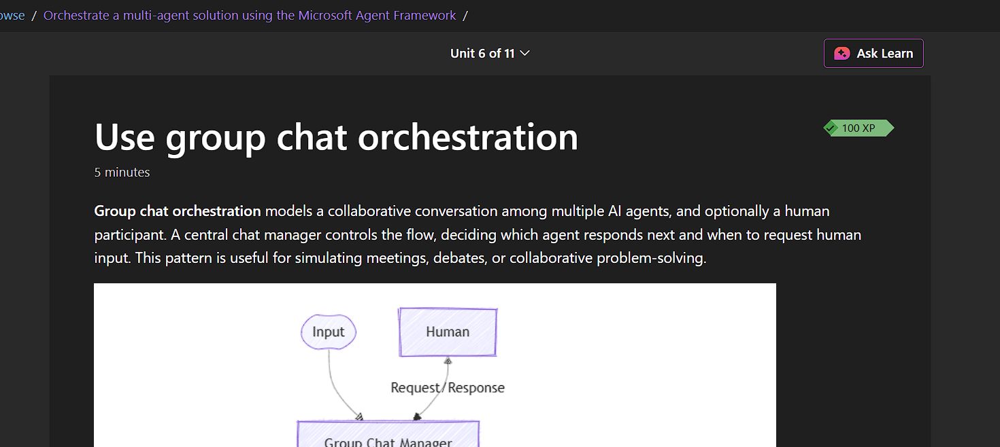

# Get started with AI agent development on Azure

As generative AI models evolve, they are moving beyond simple chat applications to power **intelligent agents** that operate autonomously to automate tasks, orchestrate business processes, and coordinate workloads.

## Single-Agent Scenario

A single agent can be designed to assist with specific corporate tasks, such as managing expense claims.

- **Knowledge Integration:** Uses generative models combined with policy documentation to answer employee queries regarding claim limits and rules.
- **Automation:** Uses programmatic functions to automatically submit recurring expenses (e.g., monthly bills) or route claims to the correct approver based on the amount.

## Multi-Agent Scenario

In complex environments, multiple agents can coordinate to manage integrated workflows across different business processes.

- **Example:** A **travel booking agent** can book flights and hotels, then automatically provide receipts and data to the **expenses agent** to complete the workflow.

# Summary: Understanding AI Agents

## 1. Definition & Core Capabilities

AI agents are smart applications that use language models to understand intent and **take autonomous action**. Unlike basic chatbots, they maintain conversation memory and execute tasks.

### Three Essential Pillars:

- **Knowledge & Reasoning:** Using generative models and grounding data (e.g., corporate policies) to answer accurately.
- **Task Automation:** Executing programmatic functions (e.g., submitting a claim or booking a flight).
- **Decision-Making:** Using business rules to route tasks or select the next logical step.

---

## 2. Agent Scenarios

- **Single-Agent (Expense Agent):** Accepts a prompt $\rightarrow$ Grounds it with policy data $\rightarrow$ Generates a response $\rightarrow$ Submits a claim/payment.
- **Multi-Agent (Travel + Expense):** A Travel Agent books services via APIs, then automatically triggers the Expense Agent to file receipts—completing an end-to-end workflow without manual intervention.

---

## 3. Security Risks & Mitigation

| Risk Area                | Description                                                                        |
| :----------------------- | :--------------------------------------------------------------------------------- |
| **Data Leakage**         | Agent exposes sensitive/confidential data it shouldn't have shared.                |
| **Prompt Injection**     | Malicious inputs trick the agent into ignoring instructions or leaking passwords.  |
| **Privilege Escalation** | Agent performs unauthorized actions (e.g., deleting records) due to weak controls. |
| **Data Poisoning**       | Corrupted training/context data leads to unsafe or fraudulent outputs.             |
| **Over-reliance**        | Actions taken automatically without necessary human validation.                    |

### Security Best Practices:

- **Least Privilege (RBAC):** Limit agent access to only the data/tools strictly required.
- **Input Validation:** Use filters to block injection attacks.
- **Human-in-the-Loop:** Require human approval for high-stakes or sensitive actions.
- **Auditability:** Maintain comprehensive logs to trace "who, what, when, and why."
- **Supply Chain Safety:** Regularly audit third-party plugins and APIs.

# Summary: AI Agent Development Options

## 1. Evolution of AI: Traditional vs. Agentic

| Feature          | Traditional AI Frameworks         | AI Agent Frameworks                             |
| :--------------- | :-------------------------------- | :---------------------------------------------- |
| **Focus**        | Enhancing apps with intelligence. | Autonomous, goal-oriented systems.              |
| **Capabilities** | Personalization, automation, NLP. | Reasoning, acting, learning, and collaboration. |
| **Interaction**  | Reactive (responds to input).     | Proactive (works to achieve goals).             |

## 2. Key Frameworks & Tools

### Pro-Code / Developer Solutions

- **Microsoft Foundry Agent Service:** Managed Azure service; offers multi-model choice, enterprise security, and Azure/OpenAI SDK support.
- **Microsoft Agent Framework:** Lightweight SDK for building and orchestrating multi-agent systems.
- **Microsoft 365 Agents SDK:** For building self-hosted agents delivered via M365, Slack, or Messenger.
- **AutoGen:** Open-source framework optimized for rapid experimentation and research.
- **OpenAI Assistants API:** Specialized for OpenAI models; integrated into Foundry Agent Service for more flexibility.

### Low-Code / No-Code Solutions

- **Microsoft Copilot Studio:** Visual "citizen developer" environment for deploying agents across enterprise channels.
- **Copilot Studio Lite (M365):** Declarative tool for business users to describe and create basic agents for daily tasks.

## 3. Decision Matrix: Choosing the Right Tool

| User Type                   | Recommended Solution      | Primary Use Case                           |
| :-------------------------- | :------------------------ | :----------------------------------------- |
| **Business User (No Code)** | Copilot Studio Lite       | Automating personal/everyday tasks.        |
| **Power User (Low Code)**   | Copilot Studio (Full)     | Extending Copilot and Teams workflows.     |
| **Pro Dev (M365 Focus)**    | M365 Agents SDK           | Custom extensions for Microsoft ecosystem. |
| **Pro Dev (Azure Focus)**   | Foundry Agent Service     | Scalable, backend-heavy Azure solutions.   |
| **Pro Dev (Multi-Agent)**   | Microsoft Agent Framework | Complex orchestration across environments. |

> **Note:** Choice is often influenced by existing infrastructure, language preference, and the need for multi-agent coordination versus simple task automation.

**Tip**

1- For more information about Foundry Agent Service, see the Microsoft Foundry Agent Service documentation. (https://learn.microsoft.com/en-us/azure/ai-services/agents/)
2- For more information about using the OpenAI Assistants API in Azure, see Getting started with Azure OpenAI Assistants. (https://learn.microsoft.com/en-us/azure/ai-services/openai/how-to/assistant)
3- For more information about AutoGen, see the (https://microsoft.github.io/autogen/stable/index.html)
4- For more information about Microsoft 365 Agents SDK, see the Microsoft 365 Agents SDK documentation. (https://learn.microsoft.com/en-us/microsoft-365/agents-sdk/)
5- For more information about Microsoft Copilot Studio, see the Microsoft Copilot Studio documentation. (https://learn.microsoft.com/en-us/microsoft-copilot-studio/)
6- For more information about authoring agents with Copilot Studio lite experience, see the Build agents with Copilot Studio lite experience.
(https://learn.microsoft.com/en-us/microsoft-365-copilot/extensibility/copilot-studio-agent-builder-build)

# Summary: Microsoft Foundry Agent Service

## 1. Overview

A managed Azure service for creating, testing, and scaling AI agents. It bridges the gap between simple chat and complex enterprise automation by providing a secure, governed runtime.

- **Development Paths:**
  - **Visual:** Low-code experience via the Microsoft Foundry portal.
  - **Code-First:** Professional development using the Foundry SDK (Python, C#, etc.).

## 2. Core Components of an Agent

- **Model:** The "brain" that powers reasoning. Supports OpenAI models (GPT-4o) and a broad catalog of open-source models (Llama, etc.).
- **Knowledge (Grounding):** Connects the agent to data to ensure factual accuracy.
  - _Sources:_ Bing Search, Azure AI Search, or custom enterprise documents.
- **Tools (Actions):** Programmatic functions that allow the agent to _do_ things.
  - _Built-in:_ Code Interpreter (runs Python), Bing Search.
  - _Custom:_ Azure Functions or custom code for API integrations.
- **Threads:** The conversation "container" that maintains message history and stores generated assets (like files).

## 3. Key Operational Primitives

- **Instructions:** System prompts that define the agent's persona, goals, and constraints.
- **Runs:** The execution of an agent on a specific thread. During a run, the agent identifies intent, selects tools, and generates responses.
- **Foundry IQ:** A specialized retrieval system (RAG) that allows multiple agents to share a single, scaleable knowledge base.

## 4. Why Use Foundry Agent Service?

- **Security:** Native integration with Microsoft Entra ID (RBAC) and VNet isolation.
- **Observability:** Built-in tracing and logging to monitor agent decisions and performance.
- **Model Router:** Automatically routes tasks to the most efficient/cost-effective model.

**Tip**

1- For more information about Foundry Agent Service, see Microsoft Foundry Agent Service documentation.
https://learn.microsoft.com/en-us/azure/ai-services/agents/

# Exercise: Explore AI Agent development

https://learn.microsoft.com/en-us/training/modules/ai-agent-fundamentals/5-exercise

# Summary: What is an AI Agent

## 1. Definition

A **fully managed service** for building, deploying, and scaling secure, extensible AI agents.

## 2. Key Technical Advantages

- **Serverless Architecture:** Developers do not need to manage underlying compute or storage.
- **Low-Code Efficiency:** Reduces the total volume of code required to deploy agents.
- **Customization:** Supports custom instructions and integration with advanced tools/APIs.
- **Security & Compliance:** Designed for high-stakes industries (like Healthcare) requiring robust data protection.

## 3. Practical Application (Healthcare Example)

- **Use Cases:** Automating patient inquiries, scheduling, and real-time medical data retrieval.
- **Primary Benefit:** Offloads infrastructure and security overhead so teams can focus on the agent's logic and quality rather than the backend.

## 1. What is an AI Agent?

An **AI Agent** is a software service that uses generative AI to understand context and perform tasks **autonomously** on behalf of a user.

- **Core Difference:** Unlike standard chat models, agents don't just "talk"—they **take action** (execute workflows, use tools, and access grounding data).
- **Key Traits:** Goal-oriented, context-aware, and capable of operating without constant human intervention.

## 2. Why Use AI Agents?

- **Automation:** Handles repetitive tasks to free up human creativity.
- **Decision-Making:** Processes massive data sets for real-time, autonomous insights.
- **Scalability:** Grows business operations without needing more staff.
- **24/7 Availability:** Continuous operation for customer service or monitoring.

## 3. Common Use Cases

| Type                      | Example Task                                             |
| :------------------------ | :------------------------------------------------------- |
| **Personal Productivity** | Scheduling, drafting emails (e.g., M365 Copilot).        |
| **Research**              | Monitoring market trends and stock performance.          |
| **Sales**                 | Automating lead qualification and follow-ups.            |
| **Customer Service**      | Handling refunds and routine inquiries (e.g., Cineplex). |
| **Developer**             | Bug fixing and code review (e.g., GitHub Copilot).       |

## 4. Critical Security Risks & Mitigations

| Risk                     | Description                                                 |
| :----------------------- | :---------------------------------------------------------- |
| **Prompt Injection**     | Malicious inputs trick the agent into unauthorized actions. |
| **Data Leakage**         | Unintentional exposure of sensitive/private data.           |
| **Privilege Escalation** | Agent accesses systems/data beyond its intended scope.      |
| **Over-Reliance**        | Executing unintended actions without human oversight.       |

### Mitigation Strategies (Security-by-Design):

- **RBAC:** Enforce Role-Based Access Control and Least Privilege.
- **Human-in-the-Loop:** Gating sensitive actions (e.g., payments) for human approval.
- **Sandboxing:** Isolating operations to prevent system-wide breaches.
- **Prompt Filtering:** Validation layers to block injection attacks.

**Tip**

1- To learn more about GitHub Copilot, explore the GitHub Copilot fundamentals learning path.
https://learn.microsoft.com/en-us/training/paths/copilot/

2- You can explore more about agents in general with the Fundamentals of AI agents module.
https://learn.microsoft.com/en-us/training/modules/ai-agent-fundamentals

# Summary: How to use Microsoft Foundry Agent Service


## Overview

Microsoft Foundry Agent Service is a **fully managed service** that allows developers to build, deploy, and scale extensible AI agents. It eliminates the need for managing underlying compute and storage resources, significantly reducing coding effort (often requiring fewer than 50 lines of code).

## Purpose and Use Cases

The service is designed for scenarios requiring advanced language models for workflow automation. It enables agents to:

- **Answer questions** using real-time or proprietary data.
- **Make decisions** and perform actions based on user input.
- **Automate workflows** by combining generative AI with tools that interact with real-world data.
- **Common Applications:** Customer support, data analysis, automated reporting, and report generation.

## Key Features

- **Automatic Tool Calling:** Manages the full lifecycle of running models, invoking tools, and returning results.
- **Managed Conversation State:** Uses "threads" to securely manage conversation states automatically.
- **Out-of-the-box Tools:** Includes support for file retrieval, code interpretation, Bing search, Azure AI Search, and Azure Functions.
- **Flexibility:** Allows for specific model selection (Azure OpenAI) and customizable storage (platform-managed or bring-your-own Azure Blob storage).
- **Security:** Provides enterprise-grade security, including keyless authentication and data privacy compliance.

## Architecture and Resources

The service provisions necessary cloud resources through Azure and AI Foundry. At a minimum, an **Azure AI hub** and an **Azure AI project** are required.

### Deployment Configurations:

1.  **Basic Agent Setup:** Includes Azure AI hub, Azure AI project, and Foundry Tools.
2.  **Standard Agent Setup:** Includes the basic setup plus Azure Key Vault, Azure AI Search, and Azure Storage.

Resources can be deployed via the Microsoft Foundry portal or through predefined **bicep templates**.

# Summary: Develop agents with the Microsoft Foundry Agent Service


## Overview

Foundry Agent Service simplifies agent creation by supporting **client-side function calling** and connections to **Azure Functions** or **OpenAPI** tools with minimal code.

> **Note on Selection:** > \* Use **Copilot Studio** for Microsoft 365 integrations.
>
> - Use **Semantic Kernel Agents Framework** for multi-agent orchestration.

## The Development Lifecycle (Implementation Steps)

To integrate an agent into an app via SDK (Python, etc.) or REST API, follow these high-level steps:

1.  **Connect:** Link to the AI Foundry project using the project endpoint and Entra ID authentication.
2.  **Reference/Create Agent:** Define the agent by specifying:
    - **Model Deployment:** The specific model (e.g., GPT-4o) used for reasoning.
    - **Instructions:** Defining behavior and functionality.
    - **Tools:** Resources the agent can invoke.
3.  **Create a Thread:** Establish a stateful chat session that retains history and data.
4.  **Message & Invoke:** Add user messages to the thread and trigger the agent.
5.  **Status Check:** Monitor the thread status; once ready, retrieve messages and artifacts.
6.  **Chat Loop:** Repeat the message and retrieval steps until the session ends.
7.  **Cleanup:** Delete the agent and thread to manage resources and data privacy.

## Agent Tools

Tools allow agents to perform tasks beyond simple text generation. They are categorized into two types:

### 1. Knowledge Tools (Grounding)

Used to enhance the agent's context with real-world or proprietary data:

- **Bing Search:** Real-time web data.
- **File Search:** Data from files in a vector store.
- **Azure AI Search:** Results from custom search indexes.
- **Microsoft Fabric:** Data from Fabric data stores.

### 2. Action Tools (Execution)

Used to perform tasks or run computations:

- **Code Interpreter:** A secure sandbox for running model-generated Python (e.g., for math or data visualization).
- **Custom Functions:** Implementation of your own local code.
- **Azure Functions:** Serverless cloud code execution.
- **OpenAPI Spec:** Calling external APIs via standard specifications.

**Tip**

1- This Fundamentals of AI Agents unit explores more of the options for building agents.
https://learn.microsoft.com/en-us/training/modules/ai-agent-fundamentals/3-agent-development

# Exercise - Build an AI agent

https://learn.microsoft.com/en-us/training/modules/develop-ai-agent-azure/5-exercise

# Unit: Develop AI agents with the Microsoft Foundry extension in Visual Studio Code

# Summary: Get started with the Microsoft Foundry extension


## Overview

The **Microsoft Foundry extension** integrates enterprise-grade AI agent development directly into Visual Studio Code. It allows developers to build, test, and deploy agents without leaving their primary code editor.

## Core Capabilities

- **Agent Discovery and Management:** Browse, create, and manage agents within existing projects.
- **Visual Agent Designer:** An intuitive graphical interface to configure instructions, models, and capabilities.
- **Integrated Testing (Playground):** Real-time interaction with agents to refine behavior before deployment.
- **Code Generation:** Automatically generates sample integration code to connect agents to applications.
- **Deployment Pipeline:** Direct deployment from VS Code to Microsoft Foundry for production.

## Key Features

- **Tool Integration:** Seamless support for **RAG** (Retrieval-Augmented Generation), Search capabilities, custom actions, and **Model Context Protocol (MCP)** servers.
- **Project Integration:** Direct connection to Microsoft Foundry projects and infrastructure resources.

## Installation and Setup

1.  **Open Extensions:** Press `Ctrl+Shift+X` in VS Code.
2.  **Search:** Look for "Microsoft Foundry."
3.  **Install:** Select the extension and verify successful installation via status messages.

## Standard Development Workflow

The extension enables rapid prototyping through a streamlined seven-step process:

1.  **Install & Configure** the extension.
2.  **Connect** to a Microsoft Foundry project.
3.  **Create/Import** an agent using the Visual Designer.
4.  **Configure** instructions and add tools (Knowledge or Action).
5.  **Test** using the built-in playground.
6.  **Iterate** based on performance and test results.
7.  **Generate Code** to integrate the agent into the final application.

# Summary: Develop AI agents in Visual Studio Code


## 1. Overview

The **Microsoft Foundry extension** for Visual Studio Code allows for designing, configuring, and testing AI agents within a unified development environment. It leverages the **Microsoft Foundry Agent Service**, a managed Azure service built on the OpenAI Assistants API.

### Key Service Features:

- **Model Choice:** Support for multiple AI models beyond OpenAI.
- **Enterprise Security:** Built-in features for production-grade security.
- **Data Integration:** Connections to Azure data services.
- **Tooling:** Access to built-in and custom tools.

## 2. Agent Creation & Prerequisites

### Prerequisites:

1.  Complete extension setup and sign in to Azure.
2.  Create or select a **Microsoft Foundry project**.
3.  Deploy an AI model to be used by the agent.

### Creation Steps:

1.  Open the **Microsoft Foundry Extension** view in VS Code.
2.  Navigate to **Resources** and click the **+ (plus)** icon next to **Agents**.
3.  The extension opens two views simultaneously:
    - **Agent Designer:** A visual interface for configuration.
    - **YAML File:** The direct configuration file (`.yaml`) containing metadata, model options, and instructions.

## 3. Configuration & Instruction Design

### Basic Properties:

- **Name & Description:** Identity and purpose of the agent.
- **Model Selection:** The specific deployment the agent will use.
- **System Instructions:** Definitions of behavior, personality, and response style.
- **Agent ID:** Automatically generated upon creation.

### Best Practices for Instructions:

- **Specificity:** Define clear actions and behaviors.
- **Context & Boundaries:** Explain the environment and what the agent _cannot_ do.
- **Examples & Personality:** Provide sample interactions and establish a specific tone.

## 4. Deployment & Management

### Deployment Process:

1.  Click **"Create on Microsoft Foundry"** in the Designer view.
2.  Once complete, refresh the **Azure Resources** view to verify the agent appears in the list.

### Management Options:

- **Edit/Redeploy:** Modify configurations and use **"Update on Microsoft Foundry"**.
- **Integration:** Use **"Open Code File"** to generate sample code for application integration.
- **Playground:** Use **"Open Playground"** for real-time testing and validation.

## 5. Testing and Conversation Concepts

The extension uses a specific structure to manage agent interactions:

- **Threads:** Conversation sessions that store messages and context.
- **Messages:** Individual units of interaction (text, images, files).
- **Runs:** Single executions where the agent processes the thread based on its configuration.

# Summary: Extend AI agent capabilities with tools


## 1. Overview of Agent Tools

Tools are programmatic functions that allow agents to automate actions and access data beyond their initial training. When an agent identifies a need, it can:

- **Invoke** the specific tool automatically.
- **Process** the data/results.
- **Incorporate** the findings into a final user response.

## 2. Built-in Tools in Microsoft Foundry

These tools are production-ready and require no additional setup:

| Tool                    | Capability                            | Use Case                                             |
| :---------------------- | :------------------------------------ | :--------------------------------------------------- |
| **Code Interpreter**    | Writes/executes Python code.          | Math, data analysis, charts, file processing.        |
| **File Search**         | Retrieval-augmented generation (RAG). | Indexing PDFs/Word docs; searching knowledge bases.  |
| **Grounding with Bing** | Real-time internet search.            | Current events, trending topics, and citations.      |
| **OpenAPI Tools**       | Connects to external APIs.            | Integrating with 3rd-party services via OpenAPI 3.0. |
| **MCP**                 | Standardized tool interfaces.         | Using community-driven tools.                        |

## 3. Adding Tools via Visual Studio Code

The extension simplifies the integration process through a visual interface:

1.  **Select Agent:** Choose the target agent in the extension view.
2.  **Navigate to Tools:** Open the Tools section in the configuration panel.
3.  **Browse Library:** Select from available built-in or custom tools.
4.  **Configure Assets:** If adding "File Search," you can create or select a **vector store asset** to host uploaded files.
5.  **Test:** Use the **Playground** to verify the tool triggers correctly.

## 4. Model Context Protocol (MCP)

MCP is an open standard designed to simplify how agents connect to external systems.

### Key Benefits:

- **Standardization:** A consistent protocol for all tool communications.
- **Reusability:** Components work across different agents/implementations.
- **Community Support:** Access to tools via MCP registries.
- **Simplified Integration:** Consistent interfaces reduce custom coding.

## 5. Management & Best Practices

To ensure reliable performance in production:

- **Identify Requirements:** Only add tools that match the agent's specific role.
- **Start Simple:** Prioritize built-in tools before developing custom ones.
- **Rigorous Testing:** Validate tool behavior in the playground under various scenarios.
- **Monitor Usage:** Track tool effectiveness and performance to optimize response times.

# Exercise - Build an AI agent using the Microsoft Foundry extension

https://learn.microsoft.com/en-us/training/modules/develop-ai-agents-vs-code/5-exercise

# Unit: Integrate custom tools into your agent

# Summary: Why use custom tools


## 1. Core Value Proposition

Custom tools move agents from general assistants to specialized workers by providing:

- **Enhanced Productivity:** Automates repetitive, high-volume tasks unique to a specific company.
- **Improved Accuracy:** Reduces human error by providing consistent, logic-based outputs from trusted data sources.
- **Tailored Solutions:** Addresses niche business needs that off-the-shelf software cannot solve.

## 2. The Decision Process (How Agents Use Tools)

When an agent receives a prompt, it follows a specific reasoning path to decide if a custom tool is required:

1.  **Intent Recognition:** The user asks a specific question (e.g., "What is my order status?").
2.  **Tool Selection:** The agent checks its available "tool belt" and identifies a custom API/tool that can answer the query.
3.  **Execution:** The agent calls the tool (e.g., queries a CRM API).
4.  **Response Synthesis:** The tool returns raw data; the agent formats it into a natural language response for the user.

## 3. Industry-Specific Scenarios

Custom tools enable deep integration across various business functions:

| Industry/Dept        | Tool Integration    | Key Functionality                                                 |
| :------------------- | :------------------ | :---------------------------------------------------------------- |
| **Customer Support** | CRM Systems         | Retrieve order history, process refunds, and update shipping.     |
| **Inventory**        | Management Systems  | Check stock levels, predict restocking needs, and auto-order.     |
| **Healthcare**       | Patient Records/EMR | Access records, suggest slots, and send automated reminders.      |
| **IT Helpdesk**      | Ticketing Systems   | Troubleshoot technical issues and track ticket resolution status. |
| **E-Learning**       | LMS Systems         | Recommend courses and track student progress based on data.       |

## 4. Operational Impacts

- **Speed:** Faster resolution of queries (Customer Support/IT).
- **Optimization:** Better resource utilization and supply chain efficiency (Inventory/Healthcare).
- **Engagement:** Increased user interaction and personalized learning (E-Learning).
- **Scalability:** Allows departments to handle higher volumes without increasing headcount.

# Summary: Options for implementing custom tools


The Microsoft Foundry Agent Service provides several options for implementing custom tools, allowing AI agents to integrate with existing infrastructure, web services, and external applications.

### 1. Function Calling (Custom Functions)

- **Description:** Allows you to describe the structure of custom functions to an agent.
- **How it works:** The agent dynamically identifies the correct function and arguments based on definitions.
- **Key Benefit:** Useful for integrating custom logic and workflows using various programming languages.

### 2. Azure Functions

- **Description:** Supports the creation of intelligent, event-driven applications with minimal overhead.
- **Key Features:**
  - **Triggers:** Determine when a function executes.
  - **Bindings:** Streamline connections to input or output data sources.
- **Key Benefit:** Simplifies interaction between AI agents and external systems.

### 3. OpenAPI Specification Tools

- **Description:** Connects agents to external APIs using the OpenAPI 3.0 standard.
- **How it works:** Uses standard descriptions of HTTP APIs to help the agent understand API functionality.
- **Key Benefit:** Provides standardized, automated, and scalable API integrations, including the ability to generate client code and tests.

### 4. Azure Logic Apps

- **Description:** A low-code/no-code action.
- **Key Benefit:** Facilitates workflows and connects apps, data, and services without extensive manual coding.

# Summary: How to integrate custom tools


Custom tools allow agents to interact with external systems and process real-time data. The agent determines when to call these tools based on the prompt's context, rather than through explicit code execution by the developer.

## 1. Function Calling

Ideal for executing predefined functions dynamically within the agent's code to retrieve data or process queries.

**Workflow:**

- Define a standard Python function.
- Register it with the `FunctionTool` and `ToolSet`.
- Enable auto-function calls in the agent client.

```python
import json

# Define the function
def recent_snowfall(location: str) -> str:
    """
    Fetches recent snowfall totals for a given location.
    :param location: The city name.
    :return: Snowfall details as a JSON string.
    """
    mock_snow_data = {"Seattle": "0 inches", "Denver": "2 inches"}
    snow = mock_snow_data.get(location, "Data not available.")
    return json.dumps({"location": location, "snowfall": snow})

user_functions: Set[Callable[..., Any]] = {
    recent_snowfall,
}

# Register and initialize
functions = FunctionTool(user_functions)
toolset = ToolSet()
toolset.add(functions)
agent_client.enable_auto_function_calls(toolset=toolset)

# Create agent
agent = agent_client.create_agent(
    model="gpt-4o-mini",
    name="snowfall-agent",
    instructions="You are a weather assistant tracking snowfall. Use the provided functions to answer questions.",
    toolset=toolset
)

```

## 2. Azure Functions

Best for serverless computing and event-driven workflows (e.g., HTTP requests or queue messages).

**Workflow:**

- Deploy an Azure Function.
- Define an `AzureFunctionTool` in the agent configuration, specifying parameters and storage queues for input/output.

```python
storage_service_endpoint = "https://<your-storage>.queue.core.windows.net"

azure_function_tool = AzureFunctionTool(
    name="get_snowfall",
    description="Get snowfall information using Azure Function",
    parameters={
            "type": "object",
            "properties": {
                "location": {"type": "string", "description": "The location to check snowfall."},
            },
            "required": ["location"],
        },
    input_queue=AzureFunctionStorageQueue(
        queue_name="input",
        storage_service_endpoint=storage_service_endpoint,
    ),
    output_queue=AzureFunctionStorageQueue(
        queue_name="output",
        storage_service_endpoint=storage_service_endpoint,
    ),
)

agent = agent_client.create_agent(
    model=os.environ["MODEL_DEPLOYMENT_NAME"],
    name="azure-function-agent",
    instructions="You are a snowfall tracking agent. Use the provided Azure Function to fetch snowfall based on location.",
    tools=azure_function_tool.definitions,
)

```

## 3. OpenAPI Specification

Uses standardized REST API definitions (OpenAPI 3.0) to interact with external services. Supported auth types: Anonymous, API Key, and Managed Identity.

**Workflow:**

- Create an OpenAPI JSON specification file.
- Load the spec and define the `OpenApiTool`.

### API Specification (snowfall_openapi.json)

```json
{
  "openapi": "3.0.0",
  "info": {
    "title": "Snowfall API",
    "version": "1.0.0"
  },
  "paths": {
    "/snow": {
      "get": {
        "summary": "Get snowfall information",
        "parameters": [
          {
            "name": "location",
            "in": "query",
            "required": true,
            "schema": {
              "type": "string"
            }
          }
        ],
        "responses": {
          "200": {
            "description": "Successful response",
            "content": {
              "application/json": {
                "schema": {
                  "type": "object",
                  "properties": {
                    "location": { "type": "string" },
                    "snow": { "type": "string" }
                  }
                }
              }
            }
          }
        }
      }
    }
  }
}
```

### Agent Registration

```python
from azure.ai.agents.models import OpenApiTool, OpenApiAnonymousAuthDetails

with open("snowfall_openapi.json", "r") as f:
    openapi_spec = json.load(f)

auth = OpenApiAnonymousAuthDetails()
openapi_tool = OpenApiTool(name="snowfall_api", spec=openapi_spec, auth=auth)

agent = agent_client.create_agent(
    model="gpt-4o-mini",
    name="openapi-agent",
    instructions="You are a snowfall tracking assistant. Use the API to fetch snowfall data.",
    tools=[openapi_tool]
)
```

## Key Concept: Declarative Integration

The solution is **declarative**. Developers do not write logic to call these tools; instead, by providing meaningful names and documentation for the parameters, the agent "figures out" when and how to call the functions based on the user's prompt.

## Unit Summary:

In this module, we covered the benefits of integrating custom tools into Foundry Agent Service to boost productivity and provide tailored business solutions. By providing custom tools to our agent, we can optimize processes to meet specific needs, resulting in better responses from your agent.

The techniques learned in this module enable businesses to generate marketing materials, improve communications, and analyze market trends more effectively, all through custom tools. The integration of various tool options in the AI Agent Service, from Azure Functions to OpenAPI specifications, allows for the creation of intelligent, event-driven applications that use well-established patterns already used in many businesses.

# Exercise - Build an agent with custom tools

https://learn.microsoft.com/en-us/training/modules/build-agent-with-custom-tools/5-exercise

# Unit: Develop a multi-agent solution with Microsoft Foundry Agent Service

# Summary: Understand connected agents


## Overview

As AI workflows grow in complexity, single-agent systems can become unmanageable. The **Microsoft Foundry Agent Service** addresses this by enabling a system of connected agents—multiple specialized agents working together cohesively.

## What are Connected Agents?

Connected agents allow for the division of large tasks into smaller, specialized roles. This system eliminates the need for custom orchestrators or hardcoded routing logic.

### Core Architecture

- **Main Agent:** Acts as the central hub; interprets user input and delegates tasks.
- **Sub-agents:** Specialized units designed for specific functions (e.g., document summarization, data retrieval, or policy validation).
- **Mechanism:** Tasks are routed using **natural language** rather than complex manual coding.

## Key Benefits

The division of labor through connected agents provides several advantages:

- **Simplified Workflows:** Breaks down complex processes into manageable parts.
- **Modular Development:** Solutions are easier to build, debug, and reuse across different projects.
- **Reliability and Traceability:** Clear separation of duties makes it easier to test individual agents and identify issues.
- **Extensibility:** New agents can be added or swapped without reworking the entire system.
- **Scalability:** Aligns AI operations with real-world business logic.

## Strategic Value

Using connected agents is particularly effective for:

- Handling sensitive tasks independently (e.g., private data processing).
- Generating personalized content.
- Building flexible systems that do not require custom orchestration logic.

# Summary: Design a multi-agent solution with connected agents


## Core Design Philosophy

Success in a multi-agent system relies on **clear role definition**. The system operates on a hub-and-spoke model where a central agent manages collaboration between specialized sub-agents.

## Roles and Responsibilities

### 1. The Main Agent (Orchestrator)

The main agent is the "brain" of the operation. Its duties include:

- **Interpreting:** Understanding the user's intent.
- **Selecting:** Choosing the right connected agent for the job.
- **Forwarding:** Providing necessary context and instructions to the sub-agent.
- **Aggregating:** Summarizing results from various agents into a final response.

### 2. Connected Agents (Domain Specialists)

These agents are built with a **single responsibility** (e.g., retrieving stock prices or validating compliance). Their duties include:

- Executing specific actions based on clear prompts.
- Using specialized tools to complete tasks.
- Returning results exclusively to the main agent.

## Implementation Steps

To build this solution in Microsoft Foundry Agent Service, follow these steps:

1. **Initialize the Client:** Connect to the Microsoft Foundry project.
2. **Create the Connected Agent:** Define the sub-agent using `create_agent` and provide specific instructions for its role.
3. **Initialize the ConnectedAgentTool:** Wrap the sub-agent definition into a tool. Assign a **name and description** so the main agent understands its purpose.
4. **Create the Main Agent:** Use `create_agent` and include the sub-agents in the `tools` property.
5. **Manage the Conversation:** \* Create a **Thread** to maintain context.
   - Create a **Message** containing the user's request.
6. **Run the Workflow:** Execute a "run." The main agent will delegate tasks and compile the response.
7. **Handle Results:** Review the final output. Note that only the main agent’s response is visible to the user; the sub-agent interactions happen in the background.

## Benefits of the Design

- **Debuggable:** Easier to isolate issues within a single-purpose agent.
- **Reusable:** Connected agents can be used across different solutions.
- **Flexible:** Provides a foundation that scales as business needs grow.

## Unit Summary:

In this module, you learned how to design and implement multi-agent solutions using Microsoft Foundry Agent Service.

Connected agents let you break down complex tasks by assigning them to specialized agents that work together within a coordinated system. You explored how to define clear roles for main and connected agents, delegate tasks using natural language, and design modular workflows that are easier to scale and maintain. You also practiced building a multi-agent solution. Great work!

# Exercise - Develop a multi-agent app with Microsoft Foundry

https://learn.microsoft.com/en-us/training/modules/develop-multi-agent-azure-ai-foundry/4-exercise

# Unit: Integrate MCP Tools with Azure AI Agents

## Summary: Understand MCP tool discovery


## The Problem

Managing AI tools manually (registering, updating, and hardcoding integrations) becomes unmanageable as systems scale. **Dynamic Tool Discovery** allows agents to find and use tools automatically at runtime.

## Microsoft Connector Protocol (MCP)

The **Microsoft Connector Protocol (MCP)** is a standardized framework that allows AI agents to connect seamlessly to external applications and services.

### Core Advantages

| Feature                   | Benefit                                                                               |
| :------------------------ | :------------------------------------------------------------------------------------ |
| **Dynamic Discovery**     | Agents receive a "live list" of tools and descriptions; no manual coding for updates. |
| **LLM Interoperability**  | Works across different models; switch LLMs without rewriting integrations.            |
| **Standardized Security** | Single authentication method for multiple servers; no need for separate API keys.     |

## What is Dynamic Tool Discovery?

It is a mechanism where an agent queries a centralized **MCP Server**—acting as a live catalog—to see what tools are available.

- **No Hardcoding:** The agent doesn't need to "know" the tools beforehand.
- **Always Current:** Agents always use the latest version of a tool without code changes.
- **Offloaded Logic:** Managing tool details moves from the agent code to a dedicated service.

## How it Works: The MCP Pipeline

1. **The MCP Server:** Hosts tools defined with the `@mcp.tool` decorator (executable functions).
2. **The MCP Client:** Connects to the server and fetches these tools dynamically.
3. **The AI Agent:** Generates "function wrappers" and adds them to its definitions to respond to user requests.

## Why Use It?

- **Scalability:** Add/update tools without redeploying the agent.
- **Modularity:** Keeps the agent focused on delegation, not tool management.
- **Maintainability:** Centralized management reduces errors and duplication.
- **Flexibility:** Supports rapid evolution of tools and complex, multi-team environments.

## Summary: Integrate agent tools using an MCP server and client


The Model Context Protocol (MCP) allows Azure AI Agents to dynamically connect to tools by separating tool management from agent logic.

## 1. The MCP Server

The **MCP Server** serves as a tool registry.

- **Initialization:** Created using `FastMCP("server-name")`.
- **Automation:** Uses Python type hints and docstrings to auto-generate tool definitions.
- **Hosting:** Definitions are served over HTTP.
- **Benefit:** Tools can be updated or added on the server without modifying or redeploying the agent.

## 2. The MCP Client

The **MCP Client** acts as the bridge between the server and the Azure AI Agent Service. It performs three main tasks:

1.  **Discovery:** Finds tools using `session.list_tools()`.
2.  **Generation:** Creates Python function stubs to wrap the tools.
3.  **Registration:** Connects these functions to the agent so they can be called like native functions.

## 3. Tool Registration & Execution

- **Invocation:** Tools are called via `session.call_tool(tool_name, tool_args)`.
- **Structure:** Each tool must be wrapped in an **async function**.
- **Bundling:** Functions are bundled into a `FunctionTool` to be included in the agent's toolset at runtime.

## 4. Workflow Overview

1.  **Host:** Define tools on the server using the `@mcp.tool` decorator.
2.  **Connect:** Client initializes a connection to the server.
3.  **Fetch:** Client retrieves definitions via `list_tools()`.
4.  **Wrap:** Each tool is placed in an async function calling `call_tool`.
5.  **Bundle:** Tools are converted into `FunctionTool` objects.
6.  **Register:** `FunctionTool` is added to the agent's toolset.

**Result:** The agent can access and invoke tools through natural language, creating a clean separation between tool maintenance and agent logic.

## Summary: Use Azure AI agents with MCP servers



## Overview

Model Context Protocol (MCP) servers allow Microsoft Foundry agents to access external tools and contextual data. This extends agent capabilities beyond built-in functions without the need to manually manage client sessions or individual function tools.

## Key Benefits

- **Simplified Integration:** No manual MCP client sessions or function tool creation required.
- **Scalability:** Connect to multiple servers simultaneously by defining separate tool objects.
- **Dynamic Access:** Use different tools from various servers based on specific prompt needs.

## Integration Requirements

To integrate a remote MCP server, you must have:

1.  **Remote Endpoint:** A valid URL (e.g., `https://api.githubcopilot.com/mcp/`).
2.  **Configured Agent:** An agent set up to utilize the MCP tool.

### Server Configuration Parameters

- **server_label:** A unique identifier for the server.
- **server_url:** The specific endpoint for the MCP server.
- **allowed_tools (Optional):** A whitelist of specific tools the agent can access.
- **Custom Headers:** Used for authentication (API keys, OAuth tokens) or other requirements. These are passed in `tool_resources` per run and are not stored.

## Tool Invocation Process

Tools are automatically invoked during an agent run. The workflow includes:

1.  **Object Creation:** Create the `McpTool` with the label and URL.
2.  **Header Application:** Use `update_headers` for required server credentials.
3.  **Approval Mode:** Set using `set_approval_mode`:
    - `always` (Default): Requires developer approval for every call.
    - `never`: Automatic execution without approval.
4.  **Toolset Management:** Add the `McpTool` to a `ToolSet` object and specify it in the agent run.

## Handling Approvals (Requires Action)

If approval is required, the run status will change to `requires_action`.

- **Review:** Check the `requires_action` field for the specific tool being called and its arguments.
- **Submission:** Submit approval by providing the `call_id` and setting `approve` to `true`.

# Exercise - Connect MCP tools to Azure AI Agents

https://learn.microsoft.com/en-us/training/modules/connect-agent-to-mcp-tools/5-exercise

# Unit: Develop an AI agent with Microsoft Agent Framework

## Summary: Introduction

## 1. Overview of AI Agents

- **Definition:** Unlike traditional programs, AI agents use generative AI to interpret data, make decisions, and complete tasks with minimal human intervention.
- **Core Function:** They leverage large language models (LLMs) to streamline complex workflows and automate business processes.

## 2. The Microsoft Agent Framework

- **Purpose:** An open-source SDK that simplifies integrating AI models into applications.
- **Compatibility:** Supports multiple providers, including:
  - Microsoft Foundry
  - Azure OpenAI & OpenAI
  - Microsoft Copilot Studio
  - Anthropic
- **Key Advantage:** Provides flexibility, scalability, and **workflow orchestration** for multi-agent solutions where collaborative agents must be coordinated.

## 3. Microsoft Foundry Agent Service

- **Service Model:** A fully managed, enterprise-grade service for building, deploying, and scaling extensible AI agents.
- **Infrastructure:** Developers do not need to manage underlying compute or storage resources.
- **Integration:** Using the Microsoft Agent Framework with this service allows for natural language processing and access to built-in tools with minimal code.

## 4. Practical Application (Tools & Functions)

- **Capabilities:** Agents can interact with APIs, retrieve data, and execute tasks.
- **Example Use Case:** An agent that extracts data from expense reports, formats them, and emails them to recipients automatically.

## 5. Learning Objectives

- Connect to a Microsoft Foundry project using the Framework.
- Create Foundry agents within the Framework.
- Extend agent capabilities by integrating **tool functions**.

## Summary: Understand Microsoft Agent Framework AI agents



## 1. Core Definition: AI Agents

- **Nature:** Autonomous programs using Generative AI (LLMs) to interpret data and make decisions.
- **Advantage:** Unlike traditional software, they handle complex workflows without continuous human oversight.
- **Framework Role:** The Microsoft Agent Framework is an open-source SDK that integrates these models into applications.

## 2. Microsoft Agent Framework: Core Components

The framework is modular, allowing components to be used individually or together:

- **Agents:** The interface for multi-agent orchestration, supporting function calling, chat history, and streaming.
- **Chat Providers:** Abstractions that allow a common interface for different services (Azure OpenAI, OpenAI, Anthropic, etc.).
- **Function Tools:** Custom containers that allow agents to trigger external APIs.
- **Built-in Tools:** Prebuilt capabilities like **Code Interpreter (Python)**, **File Search**, and **Web Search**.
- **Conversation Management:** Uses `AgentSession` for persistent context and a role-based message system (`USER`, `ASSISTANT`, `SYSTEM`, `TOOL`).
- **Workflow Orchestration:** Manages sequential tasks, concurrent execution, and "handoff" patterns between agents.

## 3. Microsoft Foundry Agents

These are "Enterprise-Level" versions of agents designed specifically for Azure environments.

- **Key Benefits:**
  - **Enterprise Integration:** Secure, compliant, and supports RBAC (Role-Based Access Control).
  - **Automatic Invocation:** Seamlessly calls tools like Azure AI Search or Azure Functions.
  - **Thread Management:** Built-in mechanisms to maintain conversation states across long sessions.
  - **Advanced Tools:** Support for Model Context Protocol (MCP) and Python execution environments.

## 4. Fundamental Framework Concepts (Quick Reference)

| Concept                 | Description                                                       |
| :---------------------- | :---------------------------------------------------------------- |
| **BaseAgent**           | The unified foundation/interface for all agent types.             |
| **Agent Session**       | Persistent storage for conversation history.                      |
| **Multi-modal Support** | Ability to process text, images, and structured outputs.          |
| **Schema Generation**   | Automatic creation of schemas from Python functions for tool use. |
| **Authentication**      | Supports Azure CLI, API keys, MSAL, and RBAC.                     |

## 5. Key Takeaway for Implementation

The architecture is provider-agnostic. You can switch between LLM providers (OpenAI to Anthropic) without changing your core code, enabling everything from simple bots to complex, multi-agent business solutions.

## Summary: Create an Azure AI agent with Microsoft Agent Framework



## 1. The Microsoft Foundry Agent Advantage

- **Specialization:** Designed for enterprise-level conversational capabilities.
- **Automation:** Automatically handles tool calling (no manual parsing/invocation needed).
- **State Management:** Securely manages conversation history using **threads**, reducing the manual overhead of maintaining state.
- **Native Tool Support:** Includes Code Interpreter, File Search, Web Search, Azure AI Search, and Azure Functions.

## 2. Implementation Workflow (5 Steps)

To deploy a Microsoft Foundry Agent, follow this sequence:

1. **Project Setup:** Create a Microsoft Foundry project.
2. **Configuration:** Add the project connection string to your application code.
3. **Authentication:** Set up credentials (typically using `AzureCliCredential`).
4. **Client Connection:** Connect to the project using the `AzureOpenAIResponsesClient` class.
5. **Agent Initialization:** Create an `Agent` instance by defining:
   - The Client
   - Instructions (System prompts)
   - Tools (Capabilities)

## 3. Key Technical Components

| Component                      | Function                                                                                  |
| :----------------------------- | :---------------------------------------------------------------------------------------- |
| **AzureOpenAIResponsesClient** | Manages the project connection; provides enterprise authentication and model access.      |
| **Agent Class**                | The "runtime" that combines the client, instructions, and tools into a working unit.      |
| **AgentSession**               | Tracks history and manages conversation state; allows for reusing existing threads.       |
| **Tools Integration**          | Automatically registers custom functions to connect with external APIs.                   |
| **Azure Identity**             | Supports `AzureCliCredential`, service principals, and MSAL for secure access.            |
| **Thread Management**          | Offers "Automatic" (simple scenarios) vs. "Explicit" (complex/long-term) thread handling. |

## 4. Operational Summary

The Foundry Agent acts as a **self-contained runtime**. By combining instructions with the `AgentSession`, it maintains security and scalability while ensuring the AI model has the context necessary to complete business-specific tasks.

## Summary: Add tools to Azure AI agent



## 1. How Tools Work

- **Mechanism:** Tools use **Function Calling**. The AI identifies a need, requests a specific function, the framework executes it in your codebase, and the results are fed back to the LLM.
- **Requirement:** For automatic calling to work, the function’s **input, output, and purpose** must be clearly described so the AI understands "how" and "when" to use it.

## 2. Built-in Tools (Ready-to-Use)

Microsoft Foundry Agents include three "out-of-the-box" tools that require no extra setup:

- **Code Interpreter:** Executes Python for math, data analysis, or logic.
- **File Search:** Analyzes and searches through uploaded documents.
- **Web Search:** Accesses real-time internet information.

## 3. Creating Custom Function Tools

To build your own tools, follow these core Python concepts:

- **The `@tool` Decorator:** Applied to a function to register it. It includes parameters for `name`, `description`, and `approval_mode`.
- **Type Annotations:** Use Pydantic’s `Annotated` and `Field` to give the AI precise instructions on what each parameter does.
- **Registration:** Pass the functions into the `ChatAgent` using the `tools` parameter (as a single function or a list).

## 4. Orchestration & Invocation

- **Automatic Execution:** You do not manually call the tool. The AI decides to trigger it based on the user's natural language request and the tool's description.
- **Multi-Tool Handling:** One agent can hold multiple tools; the framework automatically selects the right one or combines results from several.

## 5. Tool Development Best Practices

| Practice               | Importance                                                                     |
| :--------------------- | :----------------------------------------------------------------------------- |
| **Clear Descriptions** | Helps the AI understand the _intent_ of the tool.                              |
| **Type Hints**         | Ensures the AI passes the correct data formats (str, int, etc.).               |
| **Error Handling**     | Prevents the agent from crashing on unexpected inputs.                         |
| **Focused Design**     | Each tool should handle **one specific task** rather than being a "catch-all." |
| **Meaningful Returns** | Return data in a format the LLM can easily summarize for the user.             |

# Exercise - Develop an Azure AI agent with the Microsoft Agent Framework SDK

https://learn.microsoft.com/en-us/training/modules/develop-ai-agent-with-semantic-kernel/5-exercise

# Unit: Orchestrate a multi-agent solution using the Microsoft Agent Framework

## Summary: Introduction

## 1. The Multi-Agent Concept

- **When to use:** When a task is too large or complex for a single, realistic AI agent.
- **Core Benefit:** Allows specialized agents to collaborate within the **same conversation**, breaking down complex problems into modular, manageable parts.

## 2. Practical Example: DevOps Multi-Agent System

A specialized system can be built using four distinct agents working in a sequence:

- **Monitoring Agent:** Uses NLP to ingest logs/metrics and detect anomalies or trigger alerts.
- **Root Cause Analysis (RCA) Agent:** Correlates anomalies with system changes to pinpoint the source of the problem.
- **Automated Deployment Agent:** Interacts with CI/CD pipelines to implement fixes or roll back changes.
- **Reporting Agent:** Summarizes the entire process (anomaly, cause, resolution) and notifies stakeholders via email/comms.

## 3. Key Advantages

- **Modularity:** Each agent focuses on a specific domain (Separation of Concerns).
- **Efficiency:** Reduces manual human intervention in technical workflows.
- **Scalability:** Intelligent orchestration ensures that issues are resolved and communicated in a timely manner.

## 4. Orchestration Patterns

The Microsoft Agent Framework provides the "glue" for these agents to work together. Key capabilities include:

- **Collaborative Design:** Orchestrating agents so they can hand off tasks to one another.
- **Task Distribution:** Using tools and plugins across different agents in the same environment.

## 5. Learning Objectives for this Module

- Build agents using the **Microsoft Agent Framework SDK**.
- Implement **tools and plugins** for specialized functionality.
- Identify and apply different **orchestration patterns** (e.g., sequential, parallel).
- Develop end-to-end **multi-agent solutions**.

## Summary: Understand the Microsoft Agent Framework



## 1. Overview

The **Microsoft Agent Framework** is an open-source SDK designed for integrating AI models into applications. It allows developers to build agents that work independently or collaboratively to complete complex tasks by combining large language models (LLMs) with traditional programming logic.

## 2. Core Components

- **Agents:** AI-driven entities that use reasoning, tools, and conversation history to execute tasks and respond to user needs.
- **Agent Orchestration:** A unified interface that allows multiple agents to collaborate. It supports various patterns, enabling developers to switch orchestration styles without rewriting core logic.
- **Chat Clients:** Provides a common interface (`BaseChatClient`) to connect to various AI providers, including Azure OpenAI, OpenAI, and Anthropic.
- **Tools and Function Integration:** Extends agent capabilities via:
  - **Custom Functions:** Integration with external APIs and code execution.
  - **Built-in Tools:** Code Interpreter, File Search, and Web Search.
- **Conversation Management:** Uses `AgentSession` to maintain history. It utilizes a structured message system with specific roles: `USER`, `ASSISTANT`, `SYSTEM`, and `TOOL`.

## 3. Key Benefits & Use Cases

- **Provider-Agnostic:** The design allows switching between AI providers without changing the underlying code.
- **Collaboration:** Supports multi-agent workflows where specialized agents handle specific tasks (e.g., data collection or analysis).
- **Human-Agent Interaction:** Facilitates "human-in-the-loop" processes, where agents augment human decision-making and automate repetitive tasks.
- **Versatility:** Suitable for a range of applications, from basic chatbots to complex enterprise-level systems.

## Summary: Understand agent orchestration



## 1. Why Orchestration Matters

Orchestration moves beyond single-agent limitations by combining specialized agents. This allows for:

- **Specialization:** Assigning distinct roles, skills, or perspectives to different agents.
- **Improved Accuracy:** Combining outputs from multiple agents for better decision-making.
- **Complex Pipelines:** Coordinating multi-stage tasks that a single agent couldn't handle alone.
- **Dynamic Routing:** Moving control between agents based on the specific context of the task.

## 2. Core Components of a Workflow

Workflows are structured sequences that provide control, multi-agent coordination, and **checkpointing** (saving/resuming state).

### **Executors**

The "workers" of the workflow. They can be **AI agents** or **custom logic** components. They take input, perform an action, and produce output.

### **Edges (The Logic Flow)**

Edges determine how messages move between executors:

- **Direct:** Sequential flow (A → B).
- **Conditional:** Triggers only if specific criteria are met.
- **Switch-Case:** Routes to different executors based on predefined rules (e.g., VIP vs. Standard).
- **Fan-Out:** Sends one message to multiple executors at once (parallel processing).
- **Fan-In:** Combines results from multiple executors into one final output.

### **Events (Observability)**

- More info:
  https://learn.microsoft.com/en-us/training/modules/orchestrate-semantic-kernel-multi-agent-solution/3-understand-agent-orchestration

Built-in tracking for debugging and monitoring, including:

- `WorkflowStartedEvent` / `WorkflowOutputEvent`
- `ExecutorInvokeEvent` / `ExecutorCompleteEvent`
- `WorkflowErrorEvent`

## 3. Supported Orchestration Patterns

The SDK offers several "technology-agnostic" patterns:
| Pattern | Description | Best For |
| :--- | :--- | :--- |
| **Concurrent** | Broadcasts tasks to multiple agents at once. | Parallel analysis, ensemble decisions. |
| **Sequential** | Pass output from one agent to the next in a fixed order. | Step-by-step pipelines. |
| **Handoff** | Dynamically transfers control between agents. | Escalations, expert routing. |
| **Group Chat** | Shared conversation managed by a "chat manager." | Brainstorming, building consensus. |
| **Magentic** | Manager-driven; plans and adapts the path. | Open-ended, evolving problems. |

## 4. Implementation Flow

The framework uses a unified interface, allowing developers to swap patterns without rewriting agent logic:

1. **Define** agents and their capabilities.
2. **Select** an orchestration pattern.
3. **Configure** optional callbacks or transforms.
4. **Start** the runtime.
5. **Invoke** the task and retrieve results asynchronously.
6. **Retrieve** results in an asynchronous, nonblocking way.

## Summary: Use concurrent orchestration



## 1. Concept Overview

**Concurrent Orchestration** allows multiple agents to work on the same task simultaneously and independently. Instead of working in a sequence, agents generate diverse approaches or solutions in parallel, which are later gathered and combined.

## 2. When to Use vs. When to Avoid

### **Use When:**

- **Speed is a priority:** Running agents in parallel reduces total wait time.
- **Diversity of thought is needed:** Ideal for brainstorming, ensemble reasoning (combining different methods), or reaching a consensus (voting/quorum).
- **Independent tasks:** Agents have specialized skills (technical, business, creative) that do not require input from one another to begin.

### **Avoid When:**

- **Dependencies exist:** If Agent B needs Agent A's output to start, use sequential orchestration instead.
- **Resource constraints:** High parallel usage may hit model rate limits or quotas.
- **Conflict resolution is difficult:** If agents produce contradictory data that cannot be easily reconciled.
- **Strict sequencing:** The task requires a specific, repeatable order of operations.

## 3. Key Characteristics

- **Independence:** Agents do not share results with each other during execution.
- **Dynamic or Fixed:** You can call a fixed group of agents or select them dynamically based on the task.
- **Flexible Outputs:** Results can be merged into a single final answer or kept as separate actions (e.g., updating different databases).

## 4. Implementation Steps

The Microsoft Agent Framework uses a specific workflow for concurrent execution:

1.  **Create Chat Client:** Initialize the connection (e.g., `AzureOpenAIChatClient`).
2.  **Define Agents:** Create instances using `create_agent`, assigning unique roles and instructions to each.
3.  **Build Workflow:** Use the `ConcurrentBuilder` class. Add agents via the `.participants()` method and finalize with `.build()`.
4.  **Run:** Execute the workflow's `.run()` method with the initial input.
5.  **Process Results:** Use `get_outputs()` to extract results. The output contains the aggregated conversation history, identified by each agent's name.

## 5. Summary Table: Concurrent Workflow

| Feature           | Description                                           |
| :---------------- | :---------------------------------------------------- |
| **Logic Type**    | Parallel / Non-linear                                 |
| **Primary Tool**  | `ConcurrentBuilder`                                   |
| **Communication** | Agents are unaware of each other's real-time progress |
| **Outcome**       | Aggregated responses from all participants            |

## Summary: Use sequential orchestration



## 1. Concept Overview

**Sequential Orchestration** arranges agents in a linear pipeline. Each agent processes a task one after another, where the **output of one agent becomes the direct input for the next**. This creates a "step-by-step" improvement process with a fixed, predefined order.

## 2. When to Use vs. When to Avoid

### **Use When:**

- **Ordered Dependencies:** Steps must happen in a specific sequence (e.g., Draft → Review → Polish).
- **Data Transformation:** Each stage adds critical information that the next stage requires to function.
- **Gradual Refinement:** Tasks that benefit from multiple layers of processing (e.g., content creation or multi-stage reasoning).
- **Predictable Workflows:** You know exactly which agent needs to perform which task in what order.

### **Avoid When:**

- **Independence:** If stages can run in parallel without affecting quality (use Concurrent instead).
- **Simplicity:** A single agent can handle the entire task effectively.
- **Dynamic Needs:** The workflow requires backtracking, looping, or changing direction based on intermediate results.
- **Risk of Early Failure:** If an early stage produces poor output and there is no mechanism to stop or correct the downstream agents.

## 3. Key Characteristics

- **Linear Flow:** Control moves strictly from Agent A to Agent B to Agent C.
- **Fixed Order:** The sequence is decided beforehand; agents do not decide who speaks next.
- **Cumulative Context:** The final output contains the complete history of how each agent contributed.

## 4. Implementation Steps

The Microsoft Agent Framework uses the following workflow for sequential execution:

1.  **Create Chat Client:** Establish the connection (e.g., `AzureOpenAIChatClient`).
2.  **Define Agents:** Create instances for each "station" in the pipeline (e.g., a "Researcher" agent and an "Editor" agent).
3.  **Build Workflow:** Use the `SequentialBuilder` class. Add agents in the desired order via `.participants()` and finalize with `.build()`.
4.  **Run with Streaming:** Use the `run_stream` method. This allows the task to flow through the sequence asynchronously.
5.  **Process Events:** Use an async loop to monitor `WorkflowOutputEvent` instances.
6.  **Extract Conversation:** Collect the final output, which represents the refined result of the entire chain.

## 5. Summary Table: Sequential Workflow

| Feature          | Description                                             |
| :--------------- | :------------------------------------------------------ |
| **Logic Type**   | Linear Pipeline                                         |
| **Primary Tool** | `SequentialBuilder`                                     |
| **Data Flow**    | Output(n) becomes Input(n+1)                            |
| **Best For**     | Document review, data pipelines, step-by-step reasoning |

## Summary: Use group chat orchestration


