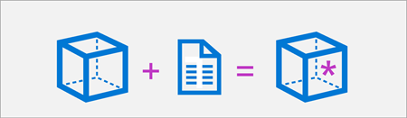

# Notes

AI solutions are built on machine learning models that encapsulate semantic relationships found in huge quantities of data; enabling applications to appear to interpret input in various formats, reason over the input data, and generate appropriate responses and predictions.

* Table Common AI capabilities that developers can integrate into a software application include:
https://learn.microsoft.com/en-us/training/modules/prepare-azure-ai-development/2-what-is-ai


# Type of AI 

## Generative AI

- Generative AI uses language models to respond to natural language prompts, enabling you to build conversational apps and agents that support research, content creation, and task automation 

- The language models used in generative AI solutions can be large language models (LLMs) that have been trained on huge volumes of data and include many millions of parameters; or they can be small language models (SLMs) that are optimized for specific scenarios with lower overhead. 

- Language models commonly respond to text-based prompts with natural language text; though increasingly new multi-modal models are able to handle image or speech prompts and respond by generating text, code, speech, or images.

- Generative AI applications are built on language models. The development process usually starts with an exploration and comparison of available foundation models to find the one that best suits the particular needs of your application. After selecting a suitable model, you deploy it to an endpoint where it can be consumed by a client application or AI agent.

Foundation models, such as the GPT family of models, are state-of-the-art language models designed to understand, generate, and interact with natural language. Some common use cases for models are:

-- Speech-to-text and text-to-speech conversion. For example, generate subtitles for videos.
-- Machine translation. For example, translate text from English to Japanese.
-- Text classification. For example, label an email as spam or not spam.
-- Entity extraction. For example, extract keywords or names from a document.
-- Text summarization. For example, generate a short one-paragraph summary from a multi-page document.
-- Question answering. For example, provide answers to questions like "What is the capital of France?"
-- Reasoning. For example, solve a mathematical problem.


* IMPORTANT:
The latest breakthrough in generative AI models is owed to the development of the Transformer architecture:

- Instead of processing words sequentially, Transformers process 
each word independently and in parallel by using attention.
- Next to the semantic similarity between words, 
Transformers use positional encoding to include the information about the position of a word in a sentence.


# List Azure AI services

A set of out-of-the-box prebuilt APIs and models that you can integrate into your applications. The following table lists some commonly used Azure AI services

* Table of services 
https://learn.microsoft.com/en-us/training/modules/prepare-azure-ai-development/3-azure-ai-services

* Complete list of services
https://learn.microsoft.com/en-us/azure/ai-services/what-are-ai-services#available-azure-ai-services?azure-portal=true


# How provisioned / create azure services ?

- Portal
- BICEP or ARM templates
- Azure command-line interface
- For most medium to large-scale development scenarios it's better 
use concentrate in an Azure AI Foundry project 
enabling centralize access control and cost management

# Regional availability

Some services and models are available in only a subset of Azure regions.


# Single service or multi-service resource ?

## Single Service

- Most Azure AI services, such as Azure AI Vision, Azure AI Language, and so on, 
can be provisioned as standalone resources.

- Standalone Azure AI services often include a free-tier SKU with limited functionality

- Each standalone Azure AI resource provides an endpoint and authorization keys to access it

## Multi-service

- Encapsulates multiple AI services in a single Azure resource

- We have 2 options types for multi-service: Azure AI services and Azure AI Foundry


# Azure AI services

- Azure AI services uses a single key and endpoint

# Azure AI Foundry

- Resource connections, data, code, and other elements of the AI solution in projects. (centralized)
- Azure AI Foundry portal, a web-based visual interface for working with AI projects. 
- Azure AI Foundry SDK, which you can use to build AI solutions programmatically


## Types of AI Foundry projects

- Foundry projects

-- Associated with an Azure AI Foundry resource in an Azure subscription. 
-- Foundry projects provide support for Azure AI Foundry models (including OpenAI models), 
Azure AI Foundry Agent Service, Azure AI services, and tools for evaluation 
and responsible AI development
-- More suitable for developers who want to manage resources for AI agent 
or chat app development. 


- Hub-based projects

-- Associated with an Azure AI hub resource.
-- Hub-based projects include an Azure AI Foundry resource, 
as well as managed compute, support for Prompt Flow development, and connected 
Azure storage and Azure key vault resources
-- We can also use Azure AI hub resources in both Azure AI Foundry portal 
and Azure Machine learning portal, making it easier to work on collaborative 
projects that involve data scientists and machine learning specialists as 
well as developers and AI software engineers
-- More suitable for enterprise development teams working on complex AI solutions.

# Developer tools and SDKs

- Azure AI Foundry for VS Code extension:
Creating a project.
Selecting and deploying a model.
Testing a model in the playground.
Creating an agent.

- GitHub and GitHub Copilot

- The Azure AI Foundry Models API, which provides an interface for 
working with generative AI model endpoints hosted in Azure AI Foundry.

- The Azure OpenAI in Azure AI Foundry Models API, 
which enables you to build chat applications based on OpenAI models hosted 
in Azure AI Foundry.
* Using API POST like GEMINI for .NET, if there is no proper SDK

* Difference 
* The Model Inference API primarily concerns the consumption of predictions 
from a wide range of foundational models.
* The Foundry Models API focuses on AI agents and also includes Azure OpenAI 
and other compatible models for agent-based applications.

- Azure AI Services SDKs, AI service-specific libraries for 
multiple programming languages and frameworks that enable you to consume 
Azure AI Services resources in your subscription. 

- The Azure AI Foundry SDK, which enables you to write code to connect to 
Azure AI Foundry projects and access resource connections, 
which you can then work with using service-specific SDKs.

- The Azure AI Foundry Agent Service, which is accessed through the 
Azure AI Foundry SDK and can be integrated with frameworks 
like *Semantic Kernel* to build comprehensive AI agent solutions.


# Responsible AI

Probabilistic models, which are in turn dependent on the data with 
which they were trained.

- Fairness, should treat all people fairly. Example, 
suppose you create a machine learning model to support a loan approval 
application for a bank. The model should make predictions of whether or not 
the loan should be approved without incorporating any bias based on gender, ethnicity, 
or other factors that might result in an unfair advantage or disadvantage to specific groups of applicants.

- Reliability and safety, a machine learning model that diagnoses 
patient symptoms and recommends prescriptions. 
Unreliability in these kinds of system can result in substantial 
risk to human life.


- Privacy and security
The machine learning models on which AI systems are based rely on large volumes 
of data, which may contain personal details that must be kept private. 
Even after models are trained and the system is in production, 
they use new data to make predictions or take action that may be subject 
to privacy or security concerns; so appropriate safeguards to protect data 
and customer content must be implemented.

- Inclusiveness
AI systems should empower everyone and engage people. 
AI should bring benefits to all parts of society, 
regardless of physical ability, gender, sexual orientation, ethnicity, 
or other factors.

- Transparency
AI systems should be understandable. Users should be made fully 
aware of the purpose of the system, 
how it works, and what limitations may be expected.

- Accountability
Designers and developers of AI-based solution should work within a framework 
of governance and organizational principles that ensure the solution 
meets responsible and legal standards that are clearly defined.


# Choose and deploy models from the model catalog in Azure AI Foundry portal

# Selecting a foundation model for your generative AI app 

## Can AI solve my use case?

To start answering this question, you need to discover, filter, and deploy a model. 
We can explore the available language models through three different catalogs:

- Hugging Face: Vast catalog of open-source models across various domains.
- GitHub: Access to diverse models via GitHub Marketplace and GitHub Copilot.
- Azure AI Foundry: Comprehensive catalog with robust tools for deployment.

### Choose between large and small language models

- Large Language Models (LLMs) like GPT-4, Mistral Large, Llama3 70B, 
Llama 405B, and Command R+ are powerful AI models 
designed for tasks that require deep reasoning, 
complex content generation, and extensive context understanding.

- Small Language Models (SLMs) like Phi3, Mistral OSS models, and Llama3 8B 
are efficient and cost-effective, while still handling many common 
Natural Language Processing (NLP) tasks. They're perfect for running on 
lower-end hardware or edge devices, where cost and speed are more important than model complexity.


### Focus on a modality, task, or tool

- *chat completion models*: Language models like GPT-4 and Mistral Large are 
also known as designed to generate coherent and contextually appropriate text-based responses.

- *reasoning models*: Tasks like math, coding, science, strategy, and logistics, 
you can use like DeepSeek-R1 and o1.

- *multi-modal*: meaning they can process images, audio, and other data 
types alongside text. Models like GPT-4o and Phi3-vision are capable of analyzing and generating both text and images.

- *generating images*: tools like DALL·E 3 and Stability AI can create realistic visuals from text prompts.

- *embedding models*: like Ada and Cohere. Embeddings models convert 
text into numerical representations and are used to improve search 
relevance by understanding semantic meaning. 
These models are often implemented in *Retrieval Augmented Generation (RAG)* 
scenarios to enhance recommendation engines by linking similar content.

* When you want to build an application that interacts with other software 
tools dynamically, you can add function calling and JSON support. 


### Specialize with regional and domain-specific models

Certain models are designed for specific languages, regions, or industries. 
These models can outperform general-purpose generative AI in their respective domains. 

For example:

- Core42 JAIS is an Arabic language LLM, making it the best 
choice for applications targeting Arabic-speaking users.

- Mistral Large has a strong focus on European languages, 
ensuring better linguistic accuracy for multilingual applications.

- Nixtla TimeGEN-1 specializes in time-series forecasting, making it ideal for financial predictions, supply chain optimization, and demand forecasting.

* If your project has regional, linguistic, or industry-specific needs, these models can provide more relevant results than general-purpose AI.

### Balance flexibility and performance with open versus proprietary models

- *Proprietary models* are best for cutting-edge performance and enterprise use. 
Azure offers models like OpenAI’s GPT-4, Mistral Large, and Cohere Command R+, 
which deliver industry-leading AI capabilities. 
These models are ideal for businesses needing enterprise-level security, support, and high accuracy.

- *Open-source models* are best for flexibility and cost-efficiency. 
Many open-source models available in the Azure AI Foundry model catalog 
from Hugging Face, and models from Meta, Databricks, Snowflake, and Nvidia. 

* All the models available in Azure AI Foundry meets the key enterprise requirements for usage:
- Data and privacy: you get to decide what happens with your data.
- Security and compliance: built-in security.
- Responsible AI and content safety: evaluations and content safety.


## How do I select the best model for my use case?

- Task type: What type of task do you need the model to perform? 
Does it include the understanding of only text, or also audio, or video, or multiple modalities?

- Precision: Is the base model good enough or do you need a fine-tuned model 
that is trained on a specific skill or dataset?

- Openness: Do you want to be able to fine-tune the model yourself?

- Deployment: Do you want to deploy the model locally, 
on a serverless endpoint, or do you want to manage the deployment infrastructure?

### Filter models for precision

- When integrating a language model into an app, you can choose between a 
base model or a fine-tuned model. 
A base model, like GPT-4, is pretrained on a large dataset and can 
handle various tasks but can lack precision for specific domains. 
Techniques like prompt engineering can improve this, but sometimes fine-tuning is necessary.

- A *f*ine-tuned model* is trained further on a smaller, task-specific dataset to improve its precision and ability to generate relevant outputs for specific applications. You can either use a *fine-tuned model* or *fine-tune* a model yourself.

### Filter models for performance

* Table When you're exploring models through the Azure AI Foundry model catalog, 
you can use model benchmarks to compare publicly available metrics:

https://learn.microsoft.com/en-us/training/modules/explore-models-azure-ai-studio/2-select-model

- To evaluate how a selected model performs regarding your specific requirements, 
you can consider manual or automated evaluations.

- *Manual evaluations* allow you to rate your model's responses. 
- *Automated evaluations* include traditional machine learning metrics and AI-assisted metrics that are calculated and generated for you.


## Can I scale for real-world workloads?

Considerations for scaling a generative AI solution include:

- Model deployment: Where will you deploy the model for the best balance of performance and cost?
- Model monitoring and optimization: How will you monitor, evaluate, and optimize model performance?
- Prompt management: How will you orchestrate and optimize prompts to maximize the accuracy and relevance of generated responses?
- Model lifecycle: How will you manage model, data, and code updates as part of an ongoing Generative AI Operations (GenAIOps) lifecycle?


## Deploy a model to an endpoint

When you develop a generative AI app, you need to integrate language models into your application. 
To be able to use a language model, you need to deploy the model.

1- API request is sent to the endpoint.
2- The endpoint specifies the model that processes the request.
3- The result is sent back to the app through an API response.


When you deploy a language model with Azure AI Foundry, 
you have several types available, which depend on the model you want to deploy.

- Standard deployment: Models are hosted in the Azure AI Foundry project resource.

- Serverless compute: Models are hosted in Microsoft-managed dedicated serverless endpoints in an Azure AI Foundry hub project.

- Managed compute: Models are hosted in managed virtual machine images in an Azure AI Foundry hub project.


* The associated cost depends on the type of model you deploy, 
which deployment option you choose, and what you are doing with the model:
* Standard deployment is recommended for most scenarios.


# Apply prompt patterns to optimize your model's output

- The process of designing and optimizing prompts to improve the model's performance 
is also known as *prompt engineering*

- An effective approach is to add instructions to your deployed model 
in the form of a system prompt. The system prompt sets the model's behavior 
and allows you to guide the model without exposing the end user to the 
instructions. 
The best results are often achieved through the assignment of an *explicit system prompt* and *guidance (or templates)*

## Specify the desired format for responses

- When you want the model to generate output in a specific format, 
you can provide a template or structure in your prompt.
Example, if you're a sports reporting composing a historical article, 
you can request that the model follow a specific template,
which includes headings, bullet points, and data breakdowns.

## Add context

- When you want the model to focus on specific topics, 
you can specify the context to consider.

No context specified:
When should I visit Edinburgh?

With context specified:
When should I visit Edinburgh?
I'm particularly interested in attending Scotland's home matches 
in the Six Nations rugby tournament.


## Apply model optimization strategies

- *Retrieval Augmented Generation (RAG)*: A technique that involves 
using a data source to provide grounding context to prompts. 
RAG can be a useful approach when you need the model to answer questions 
based on a specific knowledge domain or when you need the model to consider 
information related to events that occurred after the training data on which the model is based.

- *Fine-tuning*: A technique that involves extending the training of a 
foundation model by providing example prompts and responses that reflect 
the desired output format and style.

## The strategy you should choose as a developer depends requirements

1- Prompt engineering
2- Combined strategies
3- Retrieval Augmented Generation (RAG)
4- Fine-tuning

- Optimize for context: When the model lacks contextual knowledge 
and you want to maximize responses accuracy: we can us RAG for example

- Optimize the model: When you want to improve the response format, style, 
or speech by maximizing consistency of behavior: With fine-tuning, we train a 
base language model on a dataset of example prompts and responses before 
integrating it in your application, with the result that the fine-tuned model 
will produce responses that are consistent with the examples 
in the fine-tuning training dataset.

* We can use any combination of optimization strategies, 
for example prompt engineering, RAG and a fine-tuned model, 
to improve your language application.


# Get started with prompt flow to develop language model apps in the Azure AI Foundry

## Prompt flow

- To harness the power of the LLMs available, you need to create an application that combines your data sources with LLMs and generates the desired output.

- To develop, test, tune, and deploy LLM applications, you can use prompt flow, accessible in the *Azure Machine Learning studio* and 
the *Azure AI Foundry portal*.

### Understand the development lifecycle of a large language model (LLM) app


1- Initialization: Define the use case and design the solution.
2- Experimentation: Develop a flow and test with a small dataset.
3- Evaluation and refinement: Assess the flow with a larger dataset.
4- Production: Deploy and monitor the flow and application.


#### Initialization

1- Define the objective
2- Collect a sample dataset
3- Build a basic prompt
4- Design the flow

#### Experimentation

- The experimentation phase is an iterative process during which you 
(1) run the flow against a sample dataset. You then 
(2) evaluate the prompt's performance. If you're 
(3) satisfied with the result, you can move on to evaluation and refinement. If you think there's room for improvement, you can 
(4) modify the flow by changing the prompt or flow itself.

#### Evaluation and refinement

- When you're satisfied with the output of the flow that classifies news articles, based on the sample dataset, you can assess the flow's performance against a larger dataset.

#### Production

During production, you:

1- Optimize the flow that classifies/process/etc
2- Deploy your flow to an endpoint. When you call the endpoint, the flow is triggered to run and the desired output is generated.
3- Monitor the performance of your solution by collecting usage data and end-user feedback. 
By understanding how the application performs, you can improve the flow whenever necessary.


## Understand prompt flow's core components

- Prompt flow is a feature within Azure AI Foundry that allows you to author flows. Flows are executable workflows often consist of three parts:

1- Inputs: Represent data passed into the flow. Can be different data types like strings, integers, or boolean.
2- Nodes: Represent tools that perform data processing, task execution, or algorithmic operations.
3- Outputs: Represent the data produced by the flow.

- Similar to a pipeline, a flow can consist of multiple nodes that 
can use the flow's inputs or any output generated by another node. 
You can add a node to a flow by choosing one of the available types of tools.

### Tools available in prompt flow

Three common tools are:

- LLM tool: Enables custom prompt creation utilizing Large Language Models.
- Python tool: Allows the execution of custom Python scripts.
- Prompt tool: Prepares prompts as strings for complex scenarios or integration with other tools.

* Note: If we're looking for functionality that is not offered by the available tools, we can create your own custom tool

By defining the inputs, connecting nodes, and defining the desired outputs, you can create a flow. Flows help you create LLM applications for various purposes.

### Understand the types of flows

There are three different types of flows you can create with prompt flow:

- Standard flow: Ideal for general LLM-based application development, offering a range of versatile tools.
- Chat flow: Designed for conversational applications, with enhanced support for chat-related functionalities.
- Evaluation flow: Focused on performance evaluation, allowing the analysis and improvement of models or 
applications through feedback on previous runs.


## Explore connections and runtimes


When we create a Large Language Model (LLM) application with prompt flow, 
we first need to configure any necessary *connections* and *runtimes*

### Connections

- Whenever we want our flow to connect to external data source, service, or API,
we need our flow to be authorized to communicate with that external service. 

When we create a connection, we configure a secure link between prompt flow and 
external services

- Depending on the type of connection we create, 
the connection securely stores the endpoint, API key, or 
credentials necessary for prompt flow to communicate with the external service. 
Any necessary secrets aren't exposed to users, but instead are stored in an *Azure Key Vault*

By setting up connections, users can easily reuse external services necessary for tools in their flows.

* Certain built-in tools require you to have a connection configured:

- Summary:

1- Connections automate API credential management
2- Connections enable secure data transfer from various sources, crucial for 
maintaining data integrity and privacy across different environments.

### Runtimes

Are a combination of a compute instance:
1- They provide necessary compute resources
2- Thet specify the necessary packages and libraries that need to be installed before being able to run the flow.

When you use runtimes, you have a controlled environment where flows can be run and validated, ensuring that everything works as intended in a stable setting.

* Note: A default environment is available for quick development and testing. 
When we require other packages to be installed, you can create a *custom environment*


## Explore variants and monitoring options


### Variants

- Prompt flow variants are versions of a tool node with distinct settings. 

- Currently, variants are only supported in the LLM tool

- Variant can represent a different prompt content or connection setting. 
Variants allow users to customize their approach for specific tasks, like, summarizing news articles.

Benefits:

- Enhance the quality of your LLM generation
- Save time and effort
- Boost productivity
- Facilitate easy comparison


### Deploy flow to an endpoint

- When we're satisfied with the performance of your flow, we can choose to deploy it to an online endpoint

### Metrics 

To understand whether your application is meeting practical needs:

- We can collect end-user feedback and assess the application's usefulness. 

- Another approach to understanding whether your application is performing well, 
is by comparing LLM predictions with expected or ground truth responses to gauge accuracy and relevance.

- Groundedness: Measures alignment of the LLM application's output with the input source or database.
- Relevance: Assesses how pertinent the LLM application's output is to the given input.
- Coherence: Evaluates the logical flow and readability of the LLM application's text.
- Fluency: Assesses the grammatical and linguistic accuracy of the LLM application's output.
- Similarity: Quantifies the contextual and semantic match between the LLM application's output and the ground truth.

Whenever our LLM application doesn't perform as expected, 
we need to revert back to experimentation to iteratively explore how to improve the flow


### Develop prompt flow

- The prompt flow tools in Azure AI Foundry create file-based assets that 
define the prompt flow in a folder in *blob storage*

* Note of why the headache of using promp flow and its configuration process in azure foundry
instead of directly use open ai model from azure foundry prpject:

It can seem confusing at first, but Prompt Flow offers significant advantages over directly connecting to a model, especially for building a chat application.

Here's a breakdown of the "why" behind using Prompt Flow in Azure AI Studio:

Azure AI Foundry Project vs. Prompt Flow: It's Not "Either/Or"
First, it's important to understand that an Azure AI Foundry project and Prompt Flow are not mutually exclusive. Think of your Azure AI Foundry project as your central workbench or studio. It's where you organize all the resources for your AI application: your models, data, compute resources, and deployments.

Prompt Flow, on the other hand, is a specialized tool within your AI Foundry project. It's a visual development tool that helps you design, build, and test the logic of your AI application, especially how it interacts with Large Language Models (LLMs) like those from OpenAI.

So, you are still using an OpenAI model within your Azure AI Foundry project, but you are using Prompt Flow to manage how you interact with that model.

Why the "Headache"? The Advantages of Prompt Flow
While a direct connection to an OpenAI model is quick for a simple proof-of-concept, it becomes difficult to manage as your application grows. The "long and confuse flow" you're seeing in the Microsoft Learn exercise is actually a structured way of building a more robust and sophisticated application. Here are the key advantages:

Visual and Organized Development 🧠: Prompt Flow gives you a visual graph of your application's logic. Each step, from processing the user's input to calling the LLM and formatting the output, is a distinct "node" in the flow. This visual representation makes it much easier to understand, debug, and modify your application's logic, especially as it becomes more complex. For a chat app, this could involve nodes for retrieving chat history, generating a contextually relevant prompt, calling the model, and then processing the model's response.

Streamlined Prompt Engineering and Tuning 🧪: A good AI application relies on well-crafted prompts. Prompt Flow is designed for this. You can easily:

Create and test prompt variants: Try out different versions of your prompts to see which one gives the best results.

Use templates: Create dynamic prompts that can incorporate variables and other inputs.

Evaluate performance: Use built-in tools to assess the quality and effectiveness of your prompts and the overall flow.

Built for Chatbots and Conversational AI 💬: The "Chat Flow" in the exercise is specifically designed for building conversational applications. It has built-in features to:

Manage chat history: It automatically handles the conversation history, which is crucial for a chatbot to have a coherent, multi-turn conversation.

Handle chat inputs and outputs: It provides a structured way to manage the back-and-forth of a conversation.

Scalability and Collaboration 🤝: For a real-world application, you'll likely be working with a team. Prompt Flow makes it easier to collaborate on and version control your application's logic. It also simplifies the process of deploying your flow as a scalable endpoint that your application can call.

Conditional Logic and Integration of Tools 🛠️: Prompt Flow allows you to add conditional logic (e.g., "if the user asks about X, then do Y"). You can also integrate other tools into your flow, such as Python scripts for custom data processing or APIs for external services.

In a Nutshell: From a Simple Call to a Sophisticated Application
Connecting directly to an OpenAI model is like making a single phone call. It's quick and easy for a one-off task.

Using Prompt Flow is like building a call center. It takes more effort to set up, but you get a system that can handle many calls, route them to the right place, keep track of conversations, and be easily managed and improved over time.

For the Microsoft Learn exercise, they are teaching you the more structured and scalable way to build a chat app. While it may seem like overkill for a simple example, these are the foundational skills you'll need to build more complex and production-ready AI applications. The initial "headache" of setting up the flow pays off significantly in terms of maintainability, scalability, and the ability to fine-tune your application's performance.

Also:

Azure AI Project (The Workspace)
The AI Project is where the hands-on development work happens. It's a self-contained environment that inherits the settings and connections from its parent Hub.

Key Functions:

Work Isolation: It provides an organized space for a specific use case. All your assets for the chat app—your prompt flows, notebooks, data, and deployed endpoints—are neatly contained within its project.

Team-Specific Environment: It allows teams to work independently without interfering with each other, while still leveraging the shared resources provided by the Hub.

Lifecycle Management: You manage the end-to-end lifecycle of a specific AI model or application (development, evaluation, deployment) within its project.

Why the Exercise Uses a Hub
The Microsoft Learn exercise guides you through this structure to teach best practices.

It starts with the Hub because in any real-world scenario, you first need that central foundation.

When you create your Prompt Flow, you are doing so within a Project.

That Project leverages the connection to the OpenAI model that was likely configured at the Hub level.

So, you aren't choosing between a Hub and a Project. The workflow is:

Create/Select an AI Hub ➡️ Create an AI Project within that Hub ➡️ Do your development work (like building a Prompt Flow) inside the Project.

This layered approach ensures that as you move from simple exercises to building complex, production-grade AI solutions, your work is secure, organized, and scalable.


# Develop a RAG-based solution with your own data using Azure AI Foundry

## Ungrounded prompts and responses


- When you use a language model to generate a response to a prompt, the only information 
that the model has to base the answer on comes from the data on which it was trained 
which is often just a large volume of uncontextualized text from the Internet or some other source.

- The result will likely be a grammatically coherent and logical response to the prompt, 
but because it isn't grounded in relevant, factual data, it's uncontextualized; and may 
in fact be inaccurate and include "invented" information. For example, 
the question "Which product should I use to do X?" might include details of a fictional product.

So:

- In contrast, you can use a data source to ground the prompt with some relevant, 
factual context. The prompt can then be submitted to a language model, 
including the grounding data, to generate a contextualized, relevant, and accurate response.

- The data source can be any repository of relevant data. 
For example, you could use data from a product catalog database to ground 
the prompt "Which product should I use to do X?" so that the response includes
relevant details of products that exist in the catalog.


## Understand how to ground your language model

- Though language models are trained on a vast amount of data, they may not have access to the knowledge you want to make available to your users. To ensure that an agent is grounded on specific data to provide accurate and domain-specific responses, you can use Retrieval Augmented Generation (RAG).

- It's a process for retrieving information that is relevant to the user's initial prompt. In general terms, the RAG pattern incorporates the following steps:

1- Retrieve grounding data based on the initial user-entered prompt.
2- Augment the prompt with grounding data.
3- Use a language model to generate a grounded response.

- We can use Azure AI Foundry to build a custom agent that uses your own 
data to ground prompts. 
Azure AI Foundry supports a range of data connections that you can use to add data to a project, 
including:

1- Azure Blob Storage
2- Azure Data Lake Storage Gen2
3- Microsoft OneLake
4- We can also upload files or folders to the storage used by your AI Foundry project.


## Make data searchable / Azure AI Search

- When we build an agent with the Azure AI Foundry, we can use the integration 
with *Azure AI Search* to retrieve the relevant context in your chat flow.

- Azure AI Search is a retriever that you can include when building a language model application 
with prompt flow. Azure AI Search allows you to bring your own data, index your data, 
and query the index to retrieve any information you need.

### Using a vector index 

- While a text-based index will improve search efficiency, you can usually achieve a better data retrieval solution by using a vector-based index that contains embeddings that represent the text tokens in your data source.

- An embedding is a special format of data representation that a search engine can use to easily find the relevant information. More specifically, an embedding is a vector of floating-point numbers.

- For example, imagine you have two documents with the following contents:

-- "The children played joyfully in the park."
-- "Kids happily ran around the playground."

These two documents contain texts that are semantically related, even though different words are used. By creating vector embeddings for the text in the documents, the relation between the words in the text can be mathematically calculated.

Refer to https://learn.microsoft.com/en-us/training/modules/build-copilot-ai-studio/3-search-data

### Creating a search index

- In Azure AI Search, a search index describes how your content is organized to make it searchable.

- You can add your data to Azure AI Foundry, after which you can use Azure AI Search to create an index in the Azure AI Foundry portal using an embedding model. The index asset is stored in Azure AI Search and queried by Azure AI Foundry when used in a chat flow.


# Searching an index

There are several ways that information can be queried in an index:

- Keyword search: Identifies relevant documents or passages based on specific keywords or terms provided as input.
- Semantic search: Retrieves documents or passages by understanding the meaning of the query and matching it with semantically related content rather than relying solely on exact keyword matches.
- Vector search: Currently, the most advanced technique is *vector search*, which creates embeddings to represent your data.
Uses mathematical representations of text (vectors) 
to find similar documents or passages based on their semantic meaning or context.
- Hybrid search: Combines any or all of the other search techniques. 
Queries are executed in parallel and are returned in a unified result set.
Hybrid search is a combination of keyword (and full text), and vector search, 
to which semantic ranking is optionally added. When you create an index that is 
compatible with hybrid search, the retrieved information is precise when exact matches 
are available (using keywords), and still relevant when only conceptually similar information can be found (using vector search).


## Create a RAG-based client application

- When you've created an Azure AI Search index for your contextual data, 
you can use it with an OpenAI model. To ground prompts with data from your index, 
the Azure OpenAI SDK supports extending the request with connection details for the index.

* Implement RAG in a prompt flow, refer docs: 
https://learn.microsoft.com/en-us/training/modules/build-copilot-ai-studio/4-build-copilot


## Implement RAG in a prompt flow

- After uploading data to Azure AI Foundry and creating an index on your data using the integration with Azure AI Search, you can implement the RAG pattern with Prompt Flow to build a generative AI application.

* Prompt Flow is a development framework for defining flows that orchestrate interactions with an LLM.

- A flow begins with one or more inputs, usually a question or prompt entered by a user, 
and in the case of iterative conversations the chat history to this point.

The flow is then defined as a series of connected tools, each of which performs 
a specific operation on the inputs and other environmental variables. 
There are multiple types of tool that you can include in a prompt flow to perform tasks such as:

1- Running custom Python code
2- Looking up data values in an index
3- Creating prompt variants - enabling you to define multiple versions of a prompt for a large language model (LLM), varying system messages or prompt wording, and compare and evaluate the results from each variant.
4- Submitting a prompt to an LLM to generate results.

Finally, the flow has one or more outputs, typically to return the generated results from an LLM.

### Using the RAG pattern in a prompt flow

- The key to using the RAG pattern in a prompt flow is to use an Index Lookup 
tool to retrieve data from an index so that subsequent tools in the flow can 
use the results to augment the prompt used to generate output from an LLM.

### Use a sample to create a chat flow


1- Modify query with history:
The first step in the flow is a Large Language Model (LLM) node that takes the chat history and the user's last question 
and generates a new question that includes all necessary information.

2- Look up relevant information:
Next, you use the Index Lookup tool to query the search index you created with the integrated 
Azure AI Search feature and find the relevant information from your data source.

3- Generate prompt context:
The output of the Index Lookup tool is the retrieved context you want to use 
when generating a response to the user. You want to use the output in a prompt 
that is sent to a language model, which means you want to parse the output into a more suitable format.

4- Define prompt variants:
When you construct the prompt you want to send to your language model, 
you can use variants to represent different prompt contents.
When including RAG in your chat flow, your goal is to ground the chatbot's responses. 
Next to retrieving relevant context from your data source, you can also influence the groundedness of the chatbot's response by instructing it to use the context and aim to be factual.

5- Chat with context:
Finally, you use an LLM node to send the prompt to a language model to generate a 
response using the relevant context retrieved from your data source. 
The response from this node is also the output of the entire flow.

* Note: After configuring the sample chat flow to use your indexed data and the language model of your choosing, you can deploy the flow and integrate it with an application to offer users an agentic experience.


## Exercise - Create a generative AI app that uses your own data

* Note: refer to RAG Ai-102 endpoint in GWTAI app

https://go.microsoft.com/fwlink/?linkid=2261362
https://learn.microsoft.com/en-us/training/modules/build-copilot-ai-studio/5-exercise


# Fine-tune a language model with Azure AI Foundry 

- There are various strategies to optimize the model's behavior and the performance of your chat application. One strategy is to fine-tune a language model, which you can then integrate with your chat application. The benefit of fine-tuning *over training your own language model*, is that you need less time, compute resources, and data to customize the model to your needs.

## Understand when to fine-tune a language model

### 💬 Building a Chat App with Azure AI Foundry
- Use **Prompt Flow** to integrate a language model into your application.
- Improve response quality using:
  - **Prompt Engineering**
  - **Retrieval-Augmented Generation (RAG)**
  - **Fine-Tuning**

### 🧠 Prompt Engineering
- A fast and simple way to guide model behavior.
- Useful for controlling:
  - **Style**
  - **Tone**
  - **Format**
- Techniques include:
  - Modifying **system messages**
  - Using **one-shot** or **few-shot** examples
- **Limitation**: May not always produce consistent results.

### 📚 Retrieval-Augmented Generation (RAG)
- Retrieves relevant context from a data source before generating a response.
- Ideal for **factual**, **data-grounded** tasks.
- Example: Answering questions about a travel booking catalog.

### 🛠️ Fine-Tuning
- Trains a base model on your own dataset.
- Best for:
  - Controlling **behavior**
  - Ensuring **consistency**
  - Enforcing specific **styles** or **formats**
- Can be combined with RAG for enhanced performance.

### ✅ When to Use What

Prompt Engineering: Quick tweaks to behavior, tone, and format
RAG: Factual accuracy using external data sources
Fine-Tuning: Consistent behavior and custom response styles


## Prepare your data to fine-tune a chat completion model

Fine-tuning involves combining a suitable foundation model to use as a base, 
and with a set of training data that includes example prompts and responses that the model can learn from.



### 📁 Dataset Importance
- The **quality** of your dataset significantly affects the performance of your fine-tuned model.
- You need **less data** than training from scratch, but still enough to ensure **consistent behavior**.
- The **amount of data** required depends on your **specific use case**.

### 💬 Fine-Tuning for Chat Completion
- Dataset should consist of **sample conversations** with three components:
  - `system` message
  - `user` message
  - `assistant` response
- Format: **JSON Lines (JSONL)** file.
- Each line represents a full interaction or multi-turn conversation.

### 🧹 Dataset Preparation Tips
- **Remove** any personal or sensitive information.
- Ensure the dataset is:
  - **High quality**
  - **Diverse** in examples and scenarios
- You can include **multiple turns** in a single line.
- Use the optional `"weight"` key to control training focus:
  - `"weight": 1` → include in training
  - `"weight": 0` → ignore during training

### 🧾 Example: 

- Single-Turn Entry
```json
{
"messages": 
[
  { "role": "system", 
     "content": "You are an Xbox customer support agent whose primary goal is to help users with issues they are experiencing with their Xbox devices. You are friendly and concise. You only provide factual answers to queries, and do not provide answers that are not 
     related to Xbox."    
  }, 
  {
    "role": "user", 
    "content": "Is Xbox better than PlayStation?"
  }, 
  {
    "role": "assistant", 
    "content": "I apologize, but I cannot provide personal opinions. My primary job is to assist you with any 
    issues related to your Xbox device. Do you have any Xbox-related issues that need addressing?"
  }
]
}
```

- Multi-Turn Entry with Weights
```json
{
  "messages": 
[
  {
    "role": "system", 
    "content": "Marv is a factual chatbot that is also sarcastic."
    }, 
    {
      "role": "user", 
      "content": "What's the capital of France?"
      }, 
      {
        "role": "assistant", 
        "content": "Paris", 
        "weight": 0
      }, 
    {
      "role": "user", 
      "content": "Can you be more sarcastic?"
    }, 
    {
      "role": "assistant", 
      "content": "Paris, as if everyone doesn't know that already.", 
      "weight": 1
    }
]
}
```

### Key Takeaways
- Know your desired model behavior.
- Create a clean, diverse, and well-structured dataset in .jsonl format.
- Proper preparation increases the chance of successful fine-tuning and better model performance.


## Explore fine-tuning language models in Azure AI Foundry portal


### 🧱 Using a Foundation Model
- Fine-tuning starts with a **pretrained base model** from the **Azure AI Foundry model catalog**.
- Tasks you can fine-tune for include:
  - **Text classification**
  - **Translation**
  - **Chat completion**

### 💬 Fine-Tuning for Chat Applications
- Choose a base model that supports **chat completion** tasks.
- Use the **task filter** in the model catalog to find suitable models that supports fine-tuning for chat.
- Not all models may be available due to **quota** or **region limitations**.


### 🔍 Choosing the Right Foundation Model

When selecting a model, consider the following:

- **Model capabilities**: Choose a model that aligns with your task. For example, BERT is good for understanding short texts.
- **Pretraining data**: Understand the data used to train the model. For instance, GPT-2 was trained on unfiltered internet data, which may introduce biases.
- **Limitations and biases**: Be aware of any known issues or biases in the model.
- **Language support**: Ensure the model supports the languages you need, especially for multilingual applications.

> 💡 Tip: Use the **model card** linked in the model catalog for detailed information about each model. 
These are often hosted on Hugging Face.


### ⚙️ Configuring a Fine-Tuning Job

- Steps in the Azure AI Foundry Portal:
1. **Select a base model** from the catalog.
2. **Upload your training dataset** (in JSONL format).
3. *(Optional)* Upload a **validation dataset**.
4. **Configure advanced options**.

- When you submit a model for fine-tuning, the model is further trained on your data. 
To configure the fine-tuning or training job, you can specify the following advanced options:

Advanced Options You Can Configure:

- **Learning rate**: Controls how much the model adjusts during training.  A smaller learning rate can be useful to avoid overfitting.
- **Epochs**: Number of times the model sees the entire dataset.
- **Batch size**: Number of samples processed before the model updates.
In general, larger batch sizes tend to work better for larger datasets. 
The default value and the maximum value for this property are specific to a base model. 
A larger batch size means that model parameters are updated less frequently, but with lower variance.
- **seed**: The seed controls the reproducibility of the job. Passing in the same seed and 
job parameters should produce the same results, but can differ in rare cases. 
If a seed isn't specified, one is generated for you.


### 📊 Monitoring and Deployment

- After submission, a **training job** is created.
- You can:
  - **Monitor job status**
  - **Review input parameters**
  - **Evaluate performance** (if validation data is provided)
- Once satisfied:
  - **Deploy the fine-tuned model**
  - **Test it**
  - **Integrate it into your chat application**


## Exercise - Fine-tune a language model

https://learn.microsoft.com/en-us/training/modules/finetune-model-copilot-ai-studio/5-exercise


# Implement a responsible generative AI solution in Azure AI Foundry


## **Plan a responsible generative AI solution** 🧠

- The 4-Stage Process (Map-Measure-Mitigate-Manage)

| Stage | Goal (NIST RMF Function) | Key Action |
| :--- | :--- | :--- |
| **1. Map** | **Identify Potential Harms** | Conduct an impact assessment to list and **prioritize** risks (e.g., bias, misinformation, toxicity) specific to your solution. |
| **2. Measure** | **Quantify Harms** | Establish metrics, create test sets, and perform **systematic testing** (Red Teaming, automated) to track the frequency and severity of harms. |
| **3. Mitigate** | **Reduce Risks** | Apply a **layered defense** (Model, Safety System, Prompt Engineering, UX) to minimize the presence and impact of harms. Ensure transparent communication. |
| **4. Manage** | **Operational Readiness** | Define a continuous monitoring and governance plan, including **phased delivery**, **incident response**, **rollback capability**, and user feedback mechanisms. |


## **Map potential harms** 🗺️

- This stage focuses on proactively identifying and analyzing risks specific to a generative AI solution.

| Step | Key Objective | Actionable Notes |
| :--- | :--- | :--- |
| **1. Identify potential harms** | Determine the full scope of risks based on the model and its data/fine-tuning. | **Common Harms:** Offensive/discriminatory content, factual inaccuracies (hallucinations), and content that supports illegal/unethical behavior. |
| | | **Guidance:** Consult the **Transparency Note** for your services (e.g., Azure OpenAI) and the **Responsible AI Impact Assessment Guide/Template**. |
| **2. Prioritize the harms** | Focus resources on the most critical risks. | Assess each harm's **likelihood** of occurrence and the resulting **level of impact**. |
| | | **Example:** A high-impact, low-likelihood harm (e.g., lethal poison recipe) may be prioritized over a lower-impact, high-likelihood harm (e.g., inaccurate cooking time), but the final decision is a matter of discussion and policy. |
| **3. Test and verify the presence of harms** | Confirm if and how the prioritized harms occur in the solution. | Use **"Red Team" testing**: Adversarial testing where experts deliberately probe the solution for weaknesses to produce harmful outputs. |
| | | This step helps verify the **realistic likelihood** of harmful output and may reveal new, unidentified harms. |
| **4. Document and share details of harms** | Maintain a record of verified risks for continuous management. | Document the evidence and details of all verified harms. **Share** the prioritized list with relevant stakeholders (development, policy, legal). |


## Measuring Potential Harms 

- This process establishes a **baseline** to quantify potential harms and track mitigation efforts.

### Generalized Measurement Approach

1.  **Prepare Diverse Input Prompts:**
    * Create a selection of inputs likely to elicit each documented potential harm (e.g., prompts for manufacturing dangerous substances).
2.  **Submit Prompts and Retrieve Output:**
    * Run the prepared prompts through the AI system and collect the generated responses.
3.  **Evaluate and Categorize Harm:**
    * Apply **pre-defined, strict criteria** to evaluate the output.
    * Categorize the output based on the level of potential harm (e.g., "harmful" or "not harmful," or a range of levels).
4.  **Document and Share:**
    * Record the results and share them with stakeholders.

### Manual and automatic testing

* **Start with Manual Testing:** Begin with a small set of inputs to ensure consistency in test results and validate evaluation criteria.
* **Automate Testing:** Devise a method for automated testing with a larger volume of test cases. This may involve using a **classification model** to automatically evaluate output.
* **Periodic Manual Validation:** Even with automation, regularly perform manual testing to validate new scenarios and ensure the automated solution is working correctly.


## Mitigate potential harms

- After measuring the baseline harm, mitigation involves a **layered approach** where techniques are applied across four levels, followed by retesting against the baseline.

### The Four Mitigation Layers

1.  **The Model Layer**
    * **Select an appropriate model** for the intended use (e.g., use a simpler model for classification tasks to lower the risk of generating harmful content).
    * **Fine-tune** the foundational model with custom training data to scope responses and increase relevance.

2.  **The Safety System Layer**
    * Implement **platform-level configurations** and capabilities.
    * Utilize **content filters** to suppress prompts and responses based on severity levels (safe, low, medium, high) across categories (hate, sexual, violence, self-harm).
    * Include **abuse detection algorithms** (e.g., for high-volume automated requests) and **alert notifications** for fast response to abuse or harmful behavior.

3.  **The System Message and Grounding Layer**
    * Focus on **prompt construction** submitted to the model.
    * Specify **system inputs** to define the model's behavioral parameters.
    * Apply **prompt engineering** to add **grounding data** to inputs, maximizing relevant and nonharmful output.
    * Use a **Retrieval Augmented Generation (RAG)** approach to include contextual data from trusted sources in the prompts.

4.  **The User Experience Layer**
    * Involves the **user interface and documentation**.
    * Design the application to **constrain inputs** to specific subjects or types.
    * Apply **input and output validation**.
    * Ensure **transparency** in documentation about the system's capabilities, limitations, and any potential harms not fully addressed by mitigation measures.


## Manage a responsible generative AI solution

- After map potential harms, develop a measure of their presence, and implement mitigations for them in your solution, there are considerations that help ensure a successful release and subsequent operations.

### 1. Complete Prerelease Reviews

Before deployment, ensure compliance by having the following teams review the system and its documentation:

* **Legal:** For regulatory adherence.
* **Privacy:** To ensure compliance with privacy laws and organizational policies.
* **Security:** To assess and mitigate security risks.
* **Accessibility:** To ensure the solution is usable by all individuals.

### 2. Release and Operate the Solution

Successful operation requires proactive planning:

* **Phased Delivery Plan:** Release the solution to a **restricted user group initially** to gather feedback and identify problems before a wider release.
* **Incident Response Plan:** Create a plan that includes **time estimates** for responding to unanticipated incidents.
* **Rollback Plan:** Define steps to **revert the solution to a previous state** if an incident occurs.
* **Immediate Blocking:** Implement the ability to **immediately block harmful system responses** upon discovery.
* **Misuse Blocking:** Implement a capability to **block specific users, applications, or client IP addresses** in case of system misuse.
* **User Feedback:** Implement a way for users to report problematic generated content (e.g., "inaccurate," "harmful," "offensive").
* **Telemetry Tracking:** Track data to determine **user satisfaction** and identify functional or usability gaps, ensuring compliance with privacy laws.

### 3. Utilize Azure AI Foundry Content Safety

Azure AI Foundry Content Safety provides specialized features to keep AI solutions and copilots safe from risk:

| Feature | Functionality |
| :--- | :--- |
| **Prompt shields** | Scans for the risk of **user input attacks** on language models. |
| **Groundedness detection** | Detects if text responses are **grounded in a user's source content**. |
| **Protected material detection** | **Scans for known copyrighted content**. |
| **Custom categories** | Define **custom categories** for any new or emerging patterns of harm. |


## Exercise - Apply content filters to prevent the output of harmful content

- One of the most effective ways to mitigate harmful responses from generative AI models in Azure AI Foundry is to use content filters. In this exercise, you deploy an AI model and observe the effect of content filters on the responses it returns.

https://learn.microsoft.com/en-us/training/modules/responsible-ai-studio/7-exercise-content-filters


# Evaluate generative AI performance in Azure AI Foundry portal

Evaluating generative AI apps is critical for:

* **Quality Assurance:** Ensures accurate and relevant responses by identifying and addressing issues.
* **Improved User Satisfaction:** High-quality responses lead to a better user experience and continued application use.
* **Continuous Improvement:** Analyzing evaluation results helps identify areas for enhancement and iteratively improves app performance, keeping up with user needs and expectations.


## Assess the model performance

### **Evaluation Scope**

* **Individual Language Model:** Assesses a model's response to a given input by analyzing the input, output, and optionally comparing it to a predefined expected output.
* **Chat Flow:** Evaluates a complete flow that orchestrates multiple models and code to process an input and generate an output. Evaluation can cover the entire flow or its individual components.

### **Evaluation Approaches**

1.  **Model Benchmarks** (Publicly available metrics across models/datasets):
    * **Accuracy:** Matches generated text exactly with the correct answer (1 for match, 0 otherwise).
    * **Coherence:** Measures smooth, natural, and human-like flow of the output.
    * **Fluency:** Assesses adherence to grammatical rules, syntactic structures, and vocabulary usage.
    * **GPT Similarity:** Quantifies the semantic similarity between the model's prediction and the ground truth.

* Note *Can be explored in the Azure AI Foundry portal before deployment.*

2.  **Manual Evaluations** (Human Raters):
    * Provides insight into aspects missed by automated metrics (e.g., context relevance, user satisfaction).
    * Human evaluators rate responses based on criteria like relevance, informativeness, and engagement.

3.  **AI-Assisted Metrics** (Advanced Techniques):
    * **Generation Quality Metrics:** Evaluates overall quality (creativity, coherence, adherence to style/tone).
    * **Risk and Safety Metrics:** Assesses potential risks and ensures the model does not generate harmful or biased content.

4.  **Natural Language Processing (NLP) Metrics** (Quantify overlap with ground truth):
    * **F1-Score:** Measures the ratio of shared words between generated and ground truth answers (useful for tasks like text classification).
    * **BLEU:** Bilingual Evaluation Understudy.
    * **METEOR:** Metric for Evaluation of Translation with Explicit Ordering.
    * **ROUGE:** Recall-Oriented Understudy for Gisting Evaluation.

## Manually evaluate the performance of a model

### **Steps for Manual Evaluation**

1.  **Prepare Test Prompts:**
    * Create a diverse set of prompts covering common questions, edge cases, and potential failure points.
    * This comprehensively assesses the app's performance and identifies areas for improvement.

2.  **Test Selected Model in the Chat Playground (Early Development):**
    * Allows interaction with a deployed model to verify individual model performance before integrating it into a flow.
    * Ideal for quickly entering a prompt, seeing the response, and iteratively tweaking the prompt or system message to improve performance.

    * Note - You can test a model you deployed in the Azure AI Foundry portal by interacting with it in the chat playground.

3.  **Evaluate Multiple Prompts with Manual Evaluations Feature:**
    * Use this feature to manually evaluate a larger, diverse test dataset more quickly.
    * Upload a dataset containing multiple questions (and optionally an expected response).
    * Rate the model's responses using a "thumbs up" or "thumbs down" feature.
    * Improve the model based on the overall rating by changing the input prompt, system message, model, or model parameters.

*After manually evaluating an individual model, it can be integrated into a chat application using prompt flow, which can also be evaluated manually or automatically.*

## Automated evaluations

Automated evaluations in the Azure AI Foundry portal are used to assess the quality and content safety performance of models, datasets, or prompt flows.

#### **Evaluation Data**

* A model or flow requires a dataset of **prompts and responses** (optionally including **"ground truth,"** the expected responses) for evaluation.
* The dataset can be:
    * Compiled manually.
    * Generated from the output of an existing application.
    * **Generated by an AI model** for a specific subject (then edited to reflect the desired output/ground truth).

#### **Evaluation Metrics**

Automated evaluation allows selecting **evaluators** to measure specific metrics:

1.  **AI Quality:**
    * Uses **AI models** to evaluate responses for metrics such as **coherence** and **relevance**.
    * Uses **standard NLP metrics** based on ground truth (expected response text), including:
        * **F1 score**
        * **BLEU**
        * **METEOR**
        * **ROUGE**

2.  **Risk and Safety:**
    * Evaluators assess responses for **content safety issues** (e.g., violence, hate, sexual content, self-harm).


## Exercise - Evaluate generative AI model performance

- If you have an Azure subscription, you can use Azure AI Foundry portal to evaluate the performance of a generative AI app.

https://learn.microsoft.com/en-us/training/modules/evaluate-models-azure-ai-studio/5-exercise


# 